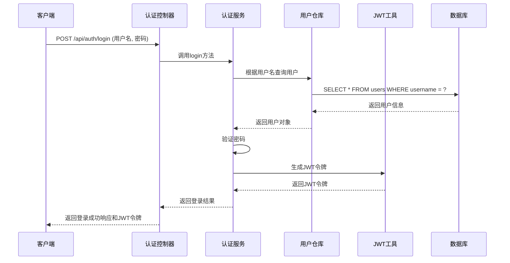
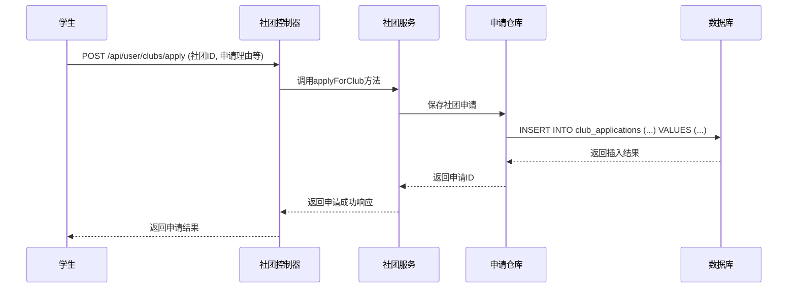
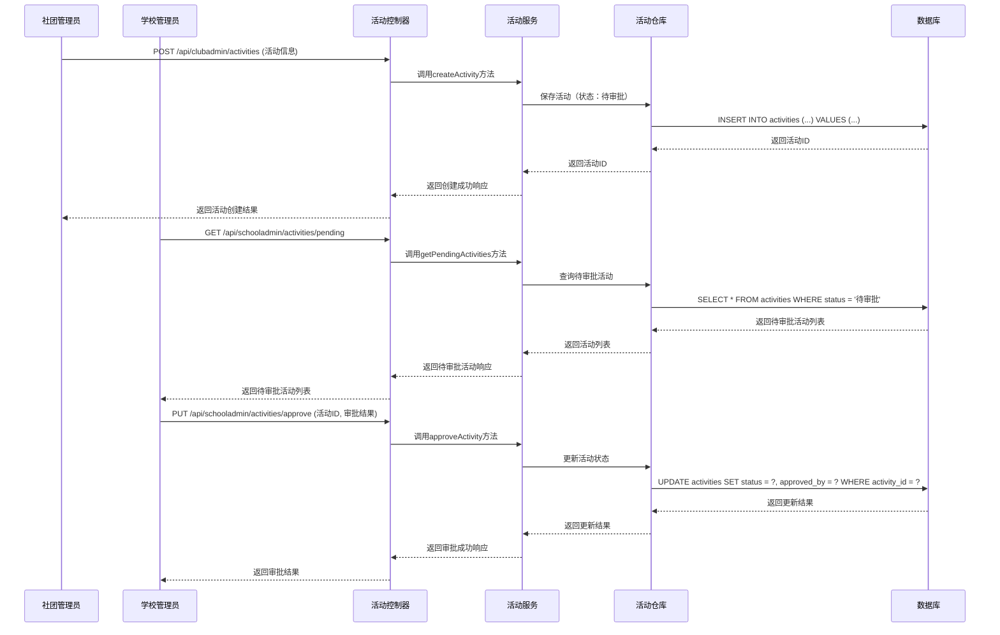
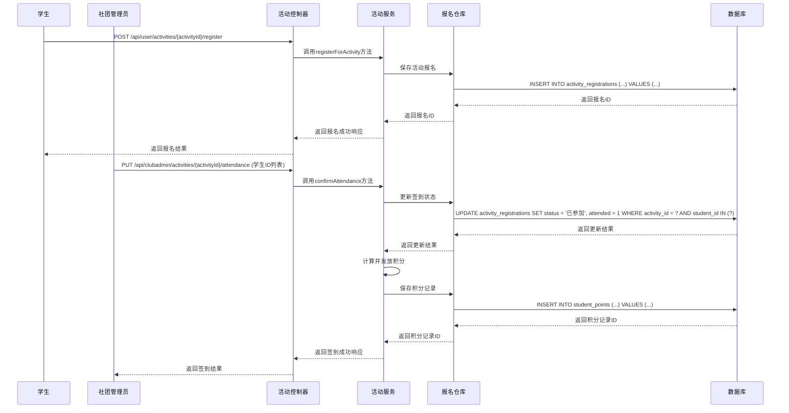

# 学校社团管理系统 - 开发阶段-迭代一设计文档

## 1. 概要设计

### 1.1 技术选型说明

| 类别 | 技术/框架 | 版本 | 用途 |
|------|-----------|------|------|
| 后端框架 | Spring Boot | 3.3.5 | 提供RESTful API服务，简化开发配置 |
| 开发语言 | Java | 21 | 系统核心开发语言 |
| 数据库 | MySQL | 8.0+ | 关系型数据库，存储系统数据 |
| ORM框架 | Spring Data JPA | 内置 | 简化数据库操作，实现对象关系映射 |
| 安全框架 | Spring Security | 内置 | 提供认证和授权功能 |
| 认证机制 | JWT (JSON Web Token) | 0.11.5 | 实现无状态认证，支持跨域访问 |
| 构建工具 | Maven | 3.8+ | 项目依赖管理和构建 |
| 代码生成 | Lombok | 1.18+ | 简化Java代码，减少样板代码 |
| 工具库 | Apache Commons Lang3 | 3.14.0 | 提供常用工具类 |

### 1.2 架构图

#### 1.2.1 系统分层架构（MVC）

```
┌─────────────────────────────────────────────────────────────────┐
│                       表现层 (Controller)                        │
├─────────────────────────────────────────────────────────────────┤
│  ┌──────────┐  ┌──────────┐  ┌──────────┐  ┌─────────────────┐  │
│  │  用户端   │  │ 社团管理员 │  │ 学校管理员 │  │  认证模块       │  │
│  │  Controller │  Controller │  Controller │  Controller     │  │
│  └──────────┘  └──────────┘  └──────────┘  └─────────────────┘  │
├─────────────────────────────────────────────────────────────────┤
│                       业务逻辑层 (Service)                       │
├─────────────────────────────────────────────────────────────────┤
│  ┌──────────┐  ┌──────────┐  ┌──────────┐  ┌─────────────────┐  │
│  │  用户服务  │  │ 社团管理服务 │  │ 学校管理服务 │  │  认证服务       │  │
│  │  Service  │  │  Service  │  │  Service  │  │  Service       │  │
│  └──────────┘  └──────────┘  └──────────┘  └─────────────────┘  │
├─────────────────────────────────────────────────────────────────┤
│                       数据访问层 (Repository)                    │
├─────────────────────────────────────────────────────────────────┤
│  ┌──────────┐  ┌──────────┐  ┌──────────┐  ┌─────────────────┐  │
│  │  学生仓库  │  │ 社团仓库  │  │ 活动仓库  │  │  管理员仓库      │  │
│  │ Repository │ Repository │ Repository │  Repository      │  │
│  └──────────┘  └──────────┘  └──────────┘  └─────────────────┘  │
├─────────────────────────────────────────────────────────────────┤
│                       数据持久层 (Entity)                        │
├─────────────────────────────────────────────────────────────────┤
│  ┌──────────┐  ┌──────────┐  ┌──────────┐  ┌─────────────────┐  │
│  │  学生实体  │  │ 社团实体  │  │ 活动实体  │  │  管理员实体      │  │
│  │  Entity   │  │  Entity   │  │  Entity   │  │  Entity        │  │
│  └──────────┘  └──────────┘  └──────────┘  └─────────────────┘  │
└─────────────────────────────────────────────────────────────────┘
```

#### 1.2.2 系统部署架构

```
┌─────────────────┐     ┌─────────────────┐     ┌─────────────────┐
│   客户端浏览器   │────▶│   Nginx反向代理  │────▶│   Spring Boot   │
└─────────────────┘     └─────────────────┘     │    应用服务器    │
                                                └─────────────────┘
                                                          │
                                                          ▼
                                                ┌─────────────────┐
                                                │    MySQL数据库   │
                                                └─────────────────┘
```

### 1.3 数据库设计

#### 1.3.1 数据库表结构

系统共包含15张核心数据表，主要分为以下几类：

1. **用户相关表**：
   - `students`：学生信息表
   - `club_admins`：社团管理员表
   - `school_admins`：学校管理员表

2. **社团相关表**：
   - `club_categories`：社团分类表
   - `clubs`：社团信息表
   - `club_members`：社团成员关系表
   - `club_applications`：社团申请表

3. **活动相关表**：
   - `activity_categories`：活动分类表
   - `activities`：活动信息表
   - `activity_registrations`：活动报名表
   - `activity_approvals`：活动审批记录表
   - `student_points`：学生活动积分表

4. **系统支持表**：
   - `help_documents`：帮助文档表
   - `faqs`：常见问题表
   - `system_logs`：系统日志表

#### 1.3.2 实体关系图 (ER图)

```
┌─────────────┐       ┌─────────────┐       ┌─────────────┐
│  students   │       │ club_admins │       │school_admins│
└─────────────┘       └─────────────┘       └─────────────┘
       │                     │                     │
       │ 1                   │ 1                   │ 1
       ▼                     ▼                     ▼
┌─────────────┐       ┌─────────────┐       ┌─────────────┐
│ club_members│◀──────┤    clubs    │◀──────┤ club_categories
└─────────────┘       └─────────────┘       └─────────────┘
       │                     │
       │                     │ 1
       │                     ▼
       │             ┌─────────────┐
       │             │club_applications
       │             └─────────────┘
       │                     │
       │                     │ 1
       │                     ▼
       │             ┌─────────────┐       ┌─────────────┐
       │             │  activities │◀──────┤activity_categories
       │             └─────────────┘       └─────────────┘
       │                     │
       │                     │ 1
       │                     ▼
       │             ┌─────────────┐       ┌─────────────┐
       └─────────────▶activity_registrations│activity_approvals
                     └─────────────┘       └─────────────┘
                             │
                             │ 1
                             ▼
                     ┌─────────────┐
                     │student_points│
                     └─────────────┘
```

## 2. 详细设计

### 2.1 系统类图

#### 2.1.1 核心实体类关系

```
┌─────────────────────────────────────────────────────────────────┐
│                         BaseEntity (抽象)                        │
├─────────────────────────────────────────────────────────────────┤
│ - id: Long                                                      │
│ - createdAt: LocalDateTime                                      │
│ - updatedAt: LocalDateTime                                      │
└─────────────────────────────────────────────────────────────────┘
                                   ▲
                                   │
           ┌────────────────────────┼────────────────────────┐
           │                        │                        │
┌─────────────────────────┐ ┌─────────────────────────┐ ┌─────────────────────────┐
│         Student         │ │        ClubAdmin        │ │      SchoolAdmin        │
├─────────────────────────┤ ├─────────────────────────┤ ├─────────────────────────┤
│ - studentId: String     │ │ - adminId: String       │ │ - adminId: String       │
│ - name: String          │ │ - clubId: Long          │ │ - role: String          │
│ - password: String      │ │ - name: String          │ │ - name: String          │
│ - email: String         │ │ - username: String      │ │ - username: String      │
│ - phone: String         │ │ - password: String      │ │ - password: String      │
│ - major: String         │ │ - email: String         │ │ - email: String         │
│ - grade: String         │ │ - phone: String         │ │ - phone: String         │
└─────────────────────────┘ └─────────────────────────┘ └─────────────────────────┘
           │                        │                        │
           │                        │                        │
           ▼                        ▼                        ▼
┌─────────────────────────┐ ┌─────────────────────────┐ ┌─────────────────────────┐
│        ClubMember       │ │          Club          │ │        Activity         │
├─────────────────────────┤ ├─────────────────────────┤ ├─────────────────────────┤
│ - clubId: Long          │ │ - clubId: Long          │ │ - activityId: Long      │
│ - studentId: String     │ │ - categoryId: Long      │ │ - clubId: Long          │
│ - joinDate: LocalDate   │ │ - name: String          │ │ - categoryId: Long      │
│ - role: String          │ │ - description: String    │ │ - title: String         │
│ - status: Integer       │ │ - logoUrl: String       │ │ - description: String    │
└─────────────────────────┘ └─────────────────────────┘ └─────────────────────────┘
           │                        │                        │
           │                        │                        │
           ▼                        ▼                        ▼
┌─────────────────────────┐ ┌─────────────────────────┐ ┌─────────────────────────┐
│   ClubApplication       │ │  ActivityRegistration   │ │  ActivityApproval       │
├─────────────────────────┤ ├─────────────────────────┤ ├─────────────────────────┤
│ - applicationId: Long   │ │ - registrationId: Long  │ │ - approvalId: Long      │
│ - studentId: String     │ │ - activityId: Long      │ │ - activityId: Long      │
│ - clubId: Long          │ │ - studentId: String     │ │ - approverId: String    │
│ - status: String        │ │ - status: String        │ │ - status: String        │
└─────────────────────────┘ └─────────────────────────┘ └─────────────────────────┘
```

### 2.2 接口设计

#### 2.2.1 接口分类

系统接口分为以下几类：

1. **认证接口**：处理用户登录、注册等认证相关操作
2. **用户端接口**：供普通学生使用的功能接口
3. **社团管理员接口**：供社团管理员使用的功能接口
4. **学校管理员接口**：供学校管理员使用的功能接口

#### 2.2.2 核心接口示例

##### 2.2.2.1 认证接口

| 接口路径 | 请求方法 | 功能描述 | 请求体 | 响应体 |
|----------|----------|----------|--------|--------|
| `/api/auth/login` | POST | 用户登录 | `LoginRequest` | `LoginResponse` |
| `/api/auth/register` | POST | 用户注册 | `RegisterRequest` | `Response` |
| `/api/auth/logout` | POST | 用户登出 | - | `Response` |

##### 2.2.2.2 社团管理接口

| 接口路径 | 请求方法 | 功能描述 | 请求体 | 响应体 |
|----------|----------|----------|--------|--------|
| `/api/user/clubs` | GET | 获取社团列表 | - | `List<ClubInfoDTO>` |
| `/api/user/clubs/{clubId}` | GET | 获取社团详情 | - | `ClubDetailDTO` |
| `/api/user/clubs/apply` | POST | 申请加入社团 | `ClubApplicationDTO` | `Response` |
| `/api/clubadmin/clubs/members` | GET | 获取社团成员列表 | - | `List<ClubMemberDTO>` |
| `/api/schooladmin/clubs` | GET | 学校管理员获取社团列表 | - | `ClubListResponseDTO` |
| `/api/schooladmin/clubs/status` | PUT | 更新社团状态 | `ClubStatusRequestDTO` | `Response` |

##### 2.2.2.3 活动管理接口

| 接口路径 | 请求方法 | 功能描述 | 请求体 | 响应体 |
|----------|----------|----------|--------|--------|
| `/api/user/activities` | GET | 获取活动列表 | - | `List<ActivityInfoDTO>` |
| `/api/user/activities/{activityId}` | GET | 获取活动详情 | - | `ActivityDetailDTO` |
| `/api/user/activities/{activityId}/register` | POST | 报名参加活动 | - | `Response` |
| `/api/clubadmin/activities` | POST | 创建活动 | `CreateActivityRequestDTO` | `Response` |
| `/api/clubadmin/activities/{activityId}` | PUT | 更新活动 | `UpdateActivityRequestDTO` | `Response` |
| `/api/schooladmin/activities/pending` | GET | 获取待审批活动列表 | - | `PendingActivityResponseDTO` |
| `/api/schooladmin/activities/approve` | PUT | 审批活动 | `ApproveActivityRequestDTO` | `Response` |

### 2.3 重要功能的流程逻辑

#### 2.3.1 用户登录流程



#### 2.3.2 社团申请流程



#### 2.3.3 活动审批流程



#### 2.3.4 活动报名与签到流程



## 3. 系统安全设计

### 3.1 认证机制

系统采用JWT（JSON Web Token）进行认证，实现无状态登录。用户登录成功后，系统生成JWT令牌，包含用户ID、角色等信息，客户端在后续请求中携带该令牌进行身份验证。

### 3.2 授权机制

系统基于角色的访问控制（RBAC），定义了三种主要角色：

1. **学生角色**：可以浏览社团和活动、申请加入社团、报名参加活动等
2. **社团管理员角色**：可以管理社团信息、管理社团成员、创建和管理活动等
3. **学校管理员角色**：可以管理社团、审批活动、管理用户等

### 3.3 数据安全

1. **密码加密**：用户密码采用BCrypt算法进行加密存储
2. **SQL注入防护**：使用Spring Data JPA的参数化查询，防止SQL注入攻击
3. **XSS防护**：对用户输入进行验证和过滤，防止跨站脚本攻击
4. **CSRF防护**：使用JWT令牌，避免CSRF攻击
5. **敏感数据保护**：敏感数据在传输过程中使用HTTPS加密

## 4. 系统扩展性设计

### 4.1 模块化设计

系统采用模块化设计，各功能模块之间低耦合，便于后续功能扩展和维护。主要模块包括：

1. **认证模块**：处理用户登录、注册、登出等
2. **社团管理模块**：处理社团信息、成员管理等
3. **活动管理模块**：处理活动创建、报名、审批等
4. **积分管理模块**：处理学生活动积分的计算和发放
5. **统计分析模块**：提供社团活跃度、学生参与度等统计分析
6. **系统支持模块**：提供帮助文档、常见问题等支持功能

### 4.2 API版本控制

系统API采用版本控制，便于后续API升级和兼容旧版本客户端。当前版本为v1，API路径格式为`/api/v1/...`。

## 5. 系统部署与维护

### 5.1 部署方式

系统采用Docker容器化部署，便于环境一致性和快速部署。主要部署步骤：

1. 构建Docker镜像
2. 配置Docker Compose文件
3. 启动容器服务
4. 配置Nginx反向代理

### 5.2 日志管理

系统使用Spring Boot内置的日志框架，记录系统运行日志、错误日志和访问日志。日志文件定期轮转，便于后续分析和排查问题。

### 5.3 监控与告警

系统集成Spring Boot Actuator，提供健康检查、 metrics监控等功能。可结合Prometheus和Grafana实现系统监控和告警。

## 6. 总结

本设计文档详细描述了学校社团管理系统的概要设计和详细设计，包括技术选型、架构设计、数据库设计、系统类图、接口设计和重要功能的流程逻辑。系统采用Spring Boot框架开发，基于MVC分层架构，实现了社团管理、活动管理、用户管理等核心功能。

系统设计考虑了安全性、扩展性和可维护性，采用了JWT认证、RBAC授权、模块化设计等技术，确保系统能够满足学校社团管理的需求，并便于后续功能扩展和维护。