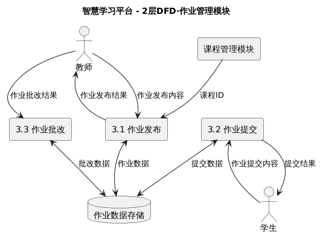
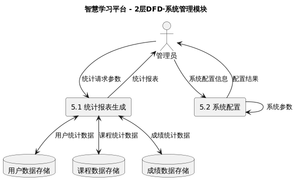

#  智慧学习平台需求分析

##  1.项目背景

随着信息技术的发展，在线教育成为主流。智慧学习平台旨在为学生、教师和管理员提供一个高效、智能的学习与管理环境，实现课程学习、作业管理、成绩查询、数据统计等功能，提升教学质量和管理效率。

## 2.项目目标
- 1.为学生提供便捷的课程学习、作业提交、成绩查询等服务。
- 2.为教师提供课程管理、作业布置与批改、成绩管理等工具。
- 3.为管理员提供用户管理、课程审核、数据统计等后台管理功能。
- 4.实现多端协同，界面友好，操作简便，数据安全。

## 3.用户角色与权限
### 1.学生（用户端）
- 注册/登录
- 浏览课程
- 选课/退课
- 在线学习（视频/课件）
- 作业提交
- 成绩查询
- 个人信息管理
### 2.教师（教师端）
- 注册/登录
- 课程管理（新建/编辑/删除课程）
- 作业管理（发布/批改作业）
- 成绩管理（录入/修改成绩）
- 学生管理（查看/管理学生）
- 个人信息管理
### 3.管理员（管理端）
- 用户管理（审核/禁用用户）
- 课程审核（审核教师发布的课程）
- 数据统计（平台数据报表）
- 系统设置（权限、公告等）

## 4.功能需求
###  1.用户端（学生）
- 注册/登录
  - 支持邮箱/手机号注册、登录
  - 忘记密码找回
- 课程浏览与选课
  - 查看课程列表、课程详情
  - 选课、退课
- 在线学习
  - 视频播放、课件下载
  - 课程讨论区
- 作业提交
  - 查看作业要求
  - 上传作业文件
  - 查看作业批改结果
- 成绩查询
  - 查看各科成绩、作业成绩
- 个人信息管理
  - 修改个人资料、密码
### 2.教师端（教师）
- 课程管理
  - 新建、编辑、删除课程
  - 管理课程内容（视频、课件、资料）
- 作业管理
  - 发布作业、设置截止时间
  - 批改作业、评分、反馈
- 成绩管理
  - 录入、修改学生成绩
  - 导出成绩报表
- 学生管理
  - 查看选课学生名单
  - 管理学生（移除、发送通知）
- 个人信息管理
  - 修改个人资料、密码

### 3.管理端（管理员）
- 用户管理
  - 审核新注册用户
  - 启用/禁用用户账号
- 课程审核
  - 审核教师发布的课程
  - 审核通过/驳回
- 数据统计
  - 平台用户数、课程数、活跃度等统计报表
- 系统设置
  - 权限分配
  - 公告发布
## 5.	非功能需求
- 性能：支持并发多人在线，响应时间<2秒
- 安全：数据加密传输，用户权限隔离，防止SQL注入
- 可扩展性：支持后续功能扩展
- 兼容性：支持主流浏览器访问

## 6.	数据需求
- 用户表（学生、教师、管理员）
- 课程表
- 作业表
- 成绩表
- 课程资源表
- 选课关联表
- 作业提交表

## 7.UML图
### 1.类图
##### 说明
```js
' 基础用户类（抽象，作为学生、教师、管理员的父类）'
abstract class User {
  - userId: String // 用户唯一标识（主键）
  - name: String // 姓名
  - account: String // 登录账号
  - password: String // 加密后的密码
  - role: String // 角色类型（student/teacher/admin）
  + register(account: String, password: String): Boolean // 注册账号，成功返回true
  + login(account: String, password: String): Boolean // 登录验证，成功返回true
  + updateInfo(): Boolean // 更新个人信息，成功返回true
}

' 学生类（继承自User）'
class Student extends User {
  - studentId: String // 学号（学生唯一标识）
  - grade: String // 年级
  - major: String // 专业
  + selectCourse(selection: CourseSelection): Boolean // 选课操作，成功返回true
  + dropCourse(selectionId: String): Boolean // 退课操作，成功返回true
  + submitHomework(homeworkId: String, fileUrl: String): Boolean // 提交作业，成功返回true
  + viewScore(): List<Score> // 查看个人成绩列表
}

' 教师类（继承自User）'
class Teacher extends User {
  - teacherId: String // 工号（教师唯一标识）
  - department: String // 所属部门
  - subject: String // 授课领域
  + createCourse(courseInfo: Course): Boolean // 创建课程，成功返回true
  + updateCourse(courseId: String): Boolean // 更新课程信息，成功返回true
  + deleteCourse(courseId: String): Boolean // 删除课程，成功返回true
  + publishHomework(homeworkInfo: Homework): Boolean // 发布作业，成功返回true
  + gradeHomework(submissionId: String, score: Float, feedback: String): Boolean // 批改作业，成功返回true
  + enterScore(scoreInfo: Score): Boolean // 录入成绩，成功返回true
}

' 管理员类（继承自User）'
class Admin extends User {
  - adminId: String // 管理员ID
  - permissionLevel: Int // 权限等级（数值越大，权限越高）
  + auditUser(userId: String, status: Boolean): Boolean // 审核用户账号，status=true为“通过审核”
  + auditCourse(courseId: String, status: Boolean): Boolean // 审核课程，status=true为“通过审核”
  + generateReport(): Report // 生成平台数据统计报表
  + setSystemConfig(config: Config): Boolean // 设置系统配置（如权限、公告），成功返回true
}

' 课程类'
class Course {
  - courseId: String // 课程唯一标识（主键）
  - courseName: String // 课程名称
  - description: String // 课程描述
  - status: String // 课程状态（待审核/已上线/已下架）
  - teacherId: String // 授课教师的userId（外键关联User）
  + addResource(resource: CourseResource): Boolean // 添加课程资源（视频/课件等），成功返回true
  + removeResource(resourceId: String): Boolean // 移除课程资源，成功返回true
  + getSelections(): List<CourseSelection> // 获取该课程的选课记录
}

' 课程资源类'
class CourseResource {
  - resourceId: String // 资源唯一标识（主键）
  - courseId: String // 所属课程ID（外键关联Course）
  - resourceType: String // 资源类型（视频/课件/文档）
  - resourceUrl: String // 资源存储地址
  - uploadTime: Date // 资源上传时间
}

' 选课关联类（处理Course与Student的多对多关系）'
class CourseSelection {
  - selectionId: String // 选课记录ID
  - courseId: String // 课程ID（外键关联Course）
  - studentId: String // 学生的userId（外键关联User）
  - selectTime: Date // 选课时间
  - status: String // 选课状态（已选/已退）
}

' 作业类'
class Homework {
  - homeworkId: String // 作业唯一标识（主键）
  - courseId: String // 所属课程ID（外键关联Course）
  - title: String // 作业标题
  - requirement: String // 作业要求
  - deadline: Date // 作业截止时间
  - status: String // 作业状态（未发布/已发布/已截止）
  + publish(): Boolean // 发布作业，成功返回true
  + closeSubmission(): Boolean // 关闭作业提交（标记为“已截止”），成功返回true
  + getSubmissions(): List<HomeworkSubmission> // 获取该作业的所有提交记录
}

' 作业提交类'
class HomeworkSubmission {
  - submissionId: String // 提交记录唯一标识（主键）
  - homeworkId: String // 所属作业ID（外键关联Homework）
  - studentId: String // 提交学生的userId（外键关联User）
  - submitFileUrl: String // 提交文件存储地址
  - submitTime: Date // 提交时间
  - score: Float // 作业分数（教师批改后赋值，可为空）
  - feedback: String // 教师反馈（批改后赋值，可为空）
}

' 成绩类'
class Score {
  - scoreId: String // 成绩唯一标识（主键）
  - studentId: String // 学生的userId（外键关联User）
  - courseId: String // 课程ID（外键关联Course）
  - homeworkId: String // 所属作业ID（作业成绩时非空，考试成绩可为空）
  - scoreValue: Float // 分数值
  - scoreType: String // 成绩类型（作业成绩/考试成绩）
  - recordTime: Date // 成绩录入时间
}

```

####  展示

### 2.对象图
#### 说明
```js
' 对象图：学生选课、提交作业、教师批改并生成成绩的场景'

' 1. 用户与角色对象'
object "userTeacher : User" {
  userId = "U001"
  name = "李老师"
  account = "li_teacher"
  role = "teacher"
}

object "userStudent : User" {
  userId = "U002"
  name = "张三"
  account = "zhang_student"
  role = "student"
}

object "teacherLi : Teacher" {
  teacherId = "T001"
  user_id = "U001"
  department = "计算机学院"
  subject = "Python编程"
}

object "studentZhang : Student" {
  studentId = "S001"
  user_id = "U002"
  grade = "2023级"
  major = "计算机科学"
}

' 2. 课程与资源对象'
object "coursePython : Course" {
  courseId = "C001"
  courseName = "Python程序设计"
  description = "Python基础与实战"
  status = "online"
  teacher_id = "U001"
}

object "resourceVideo : CourseResource" {
  resourceId = "CR001"
  course_id = "C001"
  resourceType = "video"
  resourceUrl = "/videos/python_intro.mp4"
  uploadTime = "2025-10-01"
}

' 3. 选课关联对象（多对多中间表的实例）'
object "selectionCS001 : CourseSelection" {
  selectionId = "CS001"
  course_id = "C001"
  student_id = "U002"
  selectTime = "2025-10-18"
  status = "selected"
}

' 4. 作业与提交对象'
object "homeworkFunc : Homework" {
  homeworkId = "H001"
  course_id = "C001"
  title = "Python函数作业"
  requirement = "实现常用工具函数"
  deadline = "2025-10-25"
  status = "published"
}

object "submissionHS001 : HomeworkSubmission" {
  submissionId = "HS001"
  homework_id = "H001"
  student_id = "U002"
  submitFileUrl = "/uploads/zhang_func.zip"
  submitTime = "2025-10-20"
  score = 85.5
  feedback = "代码规范，边界条件需优化"
}

' 5. 成绩对象'
object "scoreSC001 : Score" {
  scoreId = "SC001"
  student_id = "U002"
  course_id = "C001"
  homework_id = "H001"
  scoreValue = 85.5
  scoreType = "homework"
  recordTime = "2025-10-22"
}

```
#### 展示


### 3.数据流图
#### 说明
##### 0层
```
' 学生 ↔ 系统：数据流
学生 --> 系统 : 用户注册信息
学生 --> 系统 : 登录凭证
学生 --> 系统 : 选课请求
学生 --> 系统 : 作业提交内容
学生 --> 系统 : 成绩查询条件
系统 --> 学生 : 登录结果
系统 --> 学生 : 课程列表
系统 --> 学生 : 作业反馈
系统 --> 学生 : 成绩信息

' 教师 ↔ 系统：数据流
教师 --> 系统 : 教师注册信息
教师 --> 系统 : 登录凭证
教师 --> 系统 : 课程创建信息
教师 --> 系统 : 作业发布内容
教师 --> 系统 : 作业批改结果
教师 --> 系统 : 成绩录入信息
系统 --> 教师 : 登录结果
系统 --> 教师 : 课程信息
系统 --> 教师 : 作业提交列表
系统 --> 教师 : 成绩报表

' 管理员 ↔ 系统：数据流
管理员 --> 系统 : 用户审核指令
管理员 --> 系统 : 课程审核指令
管理员 --> 系统 : 统计请求参数
管理员 --> 系统 : 系统配置信息
系统 --> 管理员 : 审核结果
系统 --> 管理员 : 统计报表
系统 --> 管理员 : 配置结果反馈
```
#### 0层展示


#### 1层
##### 说明
```

' 外部实体
actor 学生
actor 教师
actor 管理员

' 核心处理模块
rectangle "1. 用户管理模块" as P_User
rectangle "2. 课程管理模块" as P_Course
rectangle "3. 作业管理模块" as P_Homework
rectangle "4. 成绩管理模块" as P_Score
rectangle "5. 系统管理模块" as P_System

' 数据存储
database "D1: 用户数据存储\n(User/Student/Teacher/Admin)" as DS_User
database "D2: 课程数据存储\n(Course/CourseResource/CourseSelection)" as DS_Course
database "D3: 作业数据存储\n(Homework/HomeworkSubmission)" as DS_Homework
database "D4: 成绩数据存储\n(Score)" as DS_Score


' 学生 ↔ 用户管理模块
学生 --> P_User : 用户注册信息
学生 --> P_User : 登录凭证
P_User --> 学生 : 登录结果
P_User <--> DS_User : 用户数据

' 教师 ↔ 用户管理模块
教师 --> P_User : 教师注册信息
教师 --> P_User : 登录凭证
P_User --> 教师 : 登录结果
P_User <--> DS_User : 教师数据

' 管理员 ↔ 用户管理模块
管理员 --> P_User : 用户审核指令
P_User --> 管理员 : 审核结果
P_User <--> DS_User : 用户审核状态

' 教师 ↔ 课程管理模块
教师 --> P_Course : 课程创建信息
教师 --> P_Course : 课程更新信息
P_Course --> 教师 : 课程操作结果
P_Course <--> DS_Course : 课程数据

' 学生 ↔ 课程管理模块
学生 --> P_Course : 选课请求
学生 --> P_Course : 退课请求
P_Course --> 学生 : 选课结果
P_Course <--> DS_Course : 选课数据

' 管理员 ↔ 课程管理模块
管理员 --> P_Course : 课程审核指令
P_Course --> 管理员 : 课程审核结果
P_Course <--> DS_Course : 课程审核状态

' 教师 ↔ 作业管理模块
教师 --> P_Homework : 作业发布内容
P_Course --> P_Homework : 课程ID
P_Homework --> 教师 : 作业发布结果
P_Homework <--> DS_Homework : 作业数据

' 学生 ↔ 作业管理模块
学生 --> P_Homework : 作业提交内容
P_Homework --> 学生 : 提交结果
P_Homework <--> DS_Homework : 提交数据

' 教师 ↔ 作业管理模块（批改）
教师 --> P_Homework : 作业批改结果
P_Homework <--> DS_Homework : 批改数据

' 教师 ↔ 成绩管理模块
教师 --> P_Score : 成绩录入信息
P_Homework --> P_Score : 批改分数
P_Score --> 教师 : 成绩录入结果
P_Score <--> DS_Score : 成绩数据

' 学生 ↔ 成绩管理模块
学生 --> P_Score : 成绩查询条件
P_Score --> 学生 : 成绩信息
P_Score <--> DS_Score : 成绩查询

' 管理员 ↔ 系统管理模块
管理员 --> P_System : 统计请求参数
P_System --> 管理员 : 统计报表
P_System <--> DS_User : 用户统计数据
P_System <--> DS_Course : 课程统计数据
P_System <--> DS_Score : 成绩统计数据

管理员 --> P_System : 系统配置信息
P_System --> 管理员 : 配置结果
P_System --> P_System : 系统参数
```

##### 展示

#### 2层
##### 2.1 用户管理模块说明
```
actor 学生
actor 教师
actor 管理员

rectangle "1.1 用户注册" as Reg
rectangle "1.2 用户登录" as Login
rectangle "1.3 用户审核" as Audit

database "用户数据存储" as UserDB

' 学生 ↔ 注册
学生 --> Reg : 用户注册信息
Reg --> 学生 : 注册结果
Reg <--> UserDB : 新用户数据

' 学生 ↔ 登录
学生 --> Login : 登录凭证
Login --> 学生 : 登录结果
Login <--> UserDB : 用户认证数据

' 教师 ↔ 注册
教师 --> Reg : 教师注册信息
Reg --> 教师 : 注册结果
Reg <--> UserDB : 新教师数据

' 教师 ↔ 登录
教师 --> Login : 登录凭证
Login --> 教师 : 登录结果
Login <--> UserDB : 教师认证数据

' 管理员 ↔ 审核
管理员 --> Audit : 用户审核指令
Audit --> 管理员 : 审核结果
Audit <--> UserDB : 用户审核状态
```
#### 2.1 用户管理模块展示


#### 2.2 课程管理模块说明
```
actor 教师
actor 学生
actor 管理员

rectangle "2.1 课程创建" as Create
rectangle "2.2 课程资源管理" as Res
rectangle "2.3 选课管理" as Select

database "课程数据存储" as CourseDB

' 教师 ↔ 课程创建
教师 --> Create : 课程创建信息
Create --> 教师 : 课程创建结果
Create <--> CourseDB : 新课程数据

' 教师 ↔ 资源管理
教师 --> Res : 资源添加信息
教师 --> Res : 资源删除指令
Res --> 教师 : 资源操作结果
Res <--> CourseDB : 课程资源数据

' 学生 ↔ 选课
学生 --> Select : 选课请求
学生 --> Select : 退课请求
Select --> 学生 : 选课结果
Select <--> CourseDB : 选课数据

' 管理员 ↔ 课程审核
管理员 --> Create : 课程审核指令
Create --> 管理员 : 课程审核结果
Create <--> CourseDB : 课程审核状态
```
#### 2.2 课程管理模块展示


#### 2.3 作业管理模块说明
```
actor 教师
actor 学生

rectangle "3.1 作业发布" as Pub
rectangle "3.2 作业提交" as Sub
rectangle "3.3 作业批改" as Grade

database "作业数据存储" as HomeworkDB

' 教师 ↔ 作业发布
教师 --> Pub : 作业发布内容
' 课程模块传递课程ID（关联课程）
rectangle "课程管理模块" as CourseMod
CourseMod --> Pub : 课程ID
Pub --> 教师 : 作业发布结果
Pub <--> HomeworkDB : 作业数据

' 学生 ↔ 作业提交
学生 --> Sub : 作业提交内容
Sub --> 学生 : 提交结果
Sub <--> HomeworkDB : 提交数据

' 教师 ↔ 作业批改
教师 --> Grade : 作业批改结果
Grade <--> HomeworkDB : 批改数据
```
#### 2.3 作业管理模块展示

#### 2.4 成绩管理模块说明
```
actor 教师
actor 学生

rectangle "4.1 成绩录入" as Enter
rectangle "4.2 成绩查询" as Query

database "成绩数据存储" as ScoreDB

' 教师 ↔ 成绩录入
教师 --> Enter : 成绩录入信息
' 作业模块传递批改分数（触发生成）
rectangle "作业管理模块" as HomeworkMod
HomeworkMod --> Enter : 批改分数
Enter --> 教师 : 成绩录入结果
Enter <--> ScoreDB : 成绩数据

' 学生 ↔ 成绩查询
学生 --> Query : 成绩查询条件
Query --> 学生 : 成绩信息
Query <--> ScoreDB : 成绩查询
```
#### 2.4 成绩管理模块展示

#### 2.5 系统管理模块说明
```
actor 管理员

rectangle "5.1 统计报表生成" as Report
rectangle "5.2 系统配置" as Config

' 复用其他模块的数据存储
database "用户数据存储" as UserDB
database "课程数据存储" as CourseDB
database "成绩数据存储" as ScoreDB

' 管理员 ↔ 统计报表
管理员 --> Report : 统计请求参数
Report --> 管理员 : 统计报表
Report <--> UserDB : 用户统计数据
Report <--> CourseDB : 课程统计数据
Report <--> ScoreDB : 成绩统计数据

' 管理员 ↔ 系统配置
管理员 --> Config : 系统配置信息
Config --> 管理员 : 配置结果
Config --> Config : 系统参数
```
#### 2.5 系统管理模块展示


