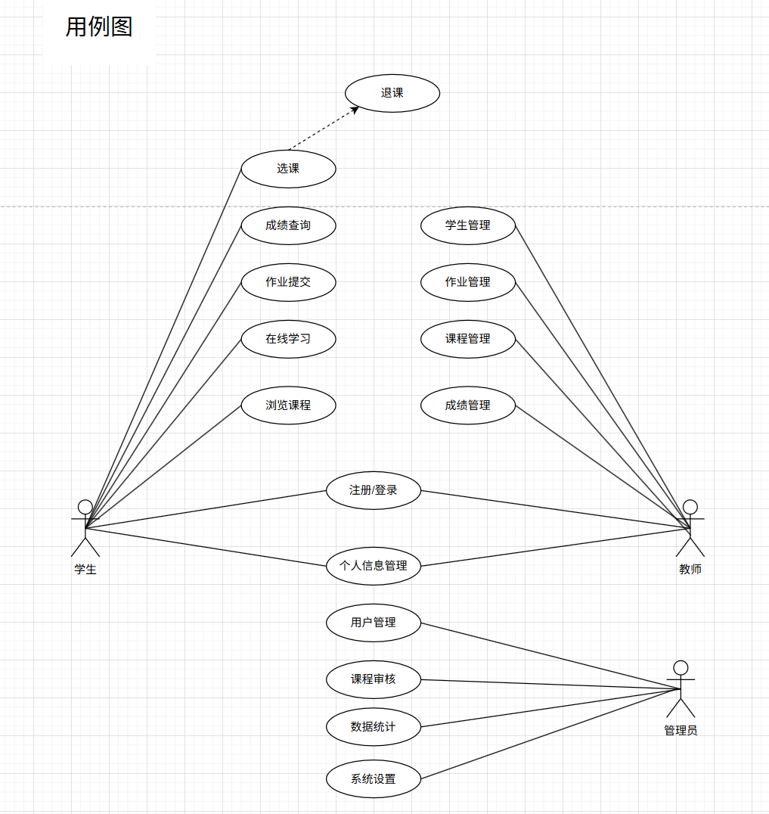

# 智慧学习平台需求文档

## 一、引言

### 1.背景

随着信息技术和互联网的飞速发展，在线教育已成为高等教育的重要组成部分。特别是在后疫情时代，远程学习和混合式教学模式的需求日益增长，传统教育方式面临着前所未有的挑战和机遇。

当前高校在教学管理中存在以下问题：
- **信息孤岛严重**：各系统独立运行，数据难以共享
- **操作繁琐**：作业批改、成绩录入等重复性工作占用大量时间
- **缺乏数据分析**：无法对教学质量进行有效的定量评估
- **学生体验不佳**：课程资源分散，学习路径不清晰

智慧学习平台旨在解决以上痛点，通过构建一个集课程管理、作业批改、成绩统计分析、数据可视化于一体的综合性学习管理平台，为学生、教师和管理员提供高效、智能的学习与管理环境。

平台的核心理念是"以学生为中心、以数据为驱动、以智能为支撑"，通过现代化的技术架构和人性化的设计，实现教学资源的优化配置，提升教学质量与管理效率，推动教育信息化高质量发展。

### 2.目标

#### 2.1 项目目标

- **提升教学效率**：减少重复性工作，将教师从繁琐的作业批改、成绩录入中解放出来
- **改善学习体验**：提供丰富的在线学习资源，支持多种学习方式，满足个性化学习需求
- **促进数据驱动**：通过数据分析帮助教师发现教学问题，优化教学方法
- **实现精细化管理**：为管理员提供全面的数据统计和分析工具，支持决策制定

#### 2.2 文档目标

本文档旨在：
- **明确需求**：详细描述系统的功能需求和非功能需求，为软件开发提供明确指导
- **规范设计**：通过UML建模工具进行系统分析和设计，确保系统的合理性和可维护性
- **指导开发**：为开发团队提供技术规范和开发标准，保证代码质量
- **支撑测试**：作为测试验收的重要依据，确保系统功能符合预期

### 3.范围

#### 3.1 本文档涵盖内容

- **功能需求**：详细描述学生端、教师端、管理员端的所有功能模块
- **非功能需求**：包括性能、可靠性、安全性、可用性等系统质量要求
- **系统设计**：包含用例图、顺序图、数据流图、类图等UML设计图
- **UI设计**：提供完整的用户界面设计和交互方案
- **接口规范**：定义系统API和第三方集成接口
- **部署方案**：描述系统的开发、测试、部署流程

#### 3.2 本系统不包含内容

- 具体的硬件设备采购方案
- 详细的算法实现和源码
- 商业化推广策略
- 用户培训材料

### 4.文档的阅读对象

- **开发人员**：作为开发指导文档，确保功能开发符合需求设计
- **项目经理**：用于项目进度把控、人员配置和功能验收决策
- **测试人员**：作为测试用例设计的重要参考依据
- **客户/用户**：帮助理解平台的功能特点和使用价值
- **系统维护人员**：了解系统架构和设计思想，便于后续维护

## 二、总体描述

### 1.软件功能

智慧学习平台采用分层架构设计，主要包含以下三大功能模块：

#### 1.1 学生端功能

学生端面向广大在校学生，提供全方位的在线学习服务：
- **用户管理**：注册/登录、密码找回、个人信息维护
- **课程学习**：课程浏览、在线选课、课程详情查看、进度跟踪
- **内容学习**：视频播放、课件下载、在线笔记、学习资料查阅
- **互动交流**：课程讨论、在线提问、学习社区
- **作业系统**：查看作业要求、提交作业、查看批改结果、作业历史
- **成绩查询**：多维度成绩查看、成绩统计分析、成绩趋势图
- **个人中心**：学习统计、个性化设置、消息通知

#### 1.2 教师端功能

教师端为教师提供完善的教学管理工具：
- **课程管理**：新建/编辑/删除课程、上传教学资源、设置课程信息
- **内容管理**：课件上传、视频管理、学习资料发布
- **作业管理**：发布作业、设置截止时间、批改作业、评分反馈
- **成绩管理**：录入/修改成绩、导出成绩报表、成绩统计分析
- **学生管理**：查看选课学生、学生分组、发送通知、移除学生
- **互动管理**：回复学生问题、课程公告、学习讨论引导
- **数据分析**：学生学习情况分析、课程质量评估

#### 1.3 管理员端功能

管理员端负责平台的运营管理和系统维护：
- **用户管理**：用户审核、账号管理、权限分配、批量操作
- **课程审核**：课程内容审核、课程信息管理、课程上架/下架
- **数据统计**：用户统计、课程统计、活跃度分析、数据报表
- **系统设置**：系统参数配置、公告发布、权限管理
- **安全监控**：日志审计、异常监控、安全事件处理
- **系统维护**：数据备份、系统升级、性能优化

### 2.主要UML图绘制和UI设计稿

#### 2.1 UML建模

为了保证系统的理论可靠性和可维护性，本项目采用UML统一建模语言进行系统分析与设计：
- **用例图**：展示用户与系统的交互关系，明确系统边界
- **顺序图**：描述系统交互的时间顺序和执行流程
- **数据流图**：多层次展示数据在系统中的流动和处理过程
- **对象图**：描述系统对象间的结构关系和交互
- **类图**：展示系统的类结构、属性和方法，以及继承、关联、组合等关系
- **活动图**：描述业务流程和活动的执行顺序
- **状态图**：展示对象状态转换过程

#### 2.2 UI设计

系统的用户界面设计遵循现代化设计理念：
- **设计风格**：采用Apple Design风格，界面简洁优雅
- **色彩系统**：统一的主色调和辅助色，不同角色采用差异化配色
- **交互设计**：流畅的动画效果、即时反馈、手势支持
- **响应式布局**：自适应多种设备屏幕，确保良好的用户体验
- **无障碍设计**：支持屏幕阅读器，符合可访问性标准

### 3.性能需求

为保证系统的高效运行，平台在性能方面有以下要求：
- **响应时间**：页面加载时间小于2秒，数据库查询响应小于500毫秒
- **并发能力**：支持10000+并发用户同时在线，单台服务器支持5000并发连接
- **数据处理**：每月可处理10000条用户数据、1000条课程数据和50000条作业成绩数据
- **资源要求**：服务器内存不低于8GB，处理器4核以上，存储500GB以上，带宽100Mbps以上

### 4.可靠性要求

系统需要具备高可靠性和稳定性：
- **故障恢复**：系统故障后30分钟内恢复服务，具备自动故障检测和告警
- **数据备份**：每周全量备份，每日增量备份，支持主从复制和异地备份
- **冗余设计**：服务器集群、数据库主从、负载均衡，避免单点故障
- **可用性**：系统可用性达99.5%以上，支持7x24小时不间断运行

### 5.可用性要求

系统应易于学习和使用：
- **简洁直观**：界面布局清晰，信息层次分明，常用功能不超过3次点击
- **视觉舒适**：配色和谐，字体大小合适，符合人体工程学
- **反馈及时**：所有操作都提供明确的成功/失败/处理中状态反馈
- **个性化**：支持界面主题自定义、字体大小调整、快捷键设置
- **帮助系统**：提供在线帮助文档、操作指引、新手引导

### 6.安全性需求

系统必须确保数据安全和用户隐私：
- **身份认证**：支持多因素认证、密码强度策略、会话管理
- **数据保护**：HTTPS加密传输、敏感数据加密存储、数据脱敏
- **系统安全**：防火墙配置、防DDoS攻击、安全审计、漏洞管理
- **隐私保护**：数据最小化收集、隐私政策、支持数据删除、合规性要求

### 7.技术架构

平台采用现代化的技术栈和架构设计：
- **前后端分离**：前端采用Vue.js等现代框架，后端采用Spring Boot等成熟框架
- **微服务架构**：模块化设计，服务独立部署，便于扩展和维护
- **数据库设计**：采用MySQL/PostgreSQL等关系型数据库，支持读写分离
- **缓存机制**：Redis缓存热点数据，提升系统响应速度
- **容器化部署**：支持Docker容器化部署，便于运维和管理

## 三、功能需求

### 1.学生端功能

#### 1.1 用户认证与管理
- **注册功能**：支持邮箱或手机号注册，提供邮箱/短信验证码验证
- **登录功能**：支持账号密码登录，记住登录状态，支持第三方登录（微信、QQ）
- **密码管理**：忘记密码找回、密码修改，要求密码强度验证
- **个人信息**：头像上传、个人信息修改、安全设置

#### 1.2 课程管理
- **课程浏览**：按分类浏览课程、课程搜索、课程推荐
- **课程详情**：查看课程介绍、教学大纲、教师信息、课程评价
- **选课功能**：在线选课、退课、选课限制管理（人数上限、时间限制）
- **我的课程**：已选课程列表、课程进度展示

#### 1.3 在线学习
- **视频学习**：视频播放、播放进度记录、倍速播放、清晰度切换
- **课件学习**：课件在线查看、下载，支持PDF、PPT等格式
- **学习笔记**：添加笔记、笔记管理、笔记分享
- **学习进度**：自动记录学习进度，可视化进度展示

#### 1.4 作业系统
- **作业查看**：查看作业要求、截止时间、已完成/未完成状态
- **作业提交**：上传作业文件（支持多文件）、提交确认、修改提交
- **作业批改**：查看批改结果、评语、成绩、批改反馈
- **作业历史**：历史作业列表、作业统计分析

#### 1.5 成绩查询
- **成绩查看**：各科成绩查询、作业成绩查询、总评成绩查看
- **成绩分析**：成绩趋势图、成绩排名、成绩分布统计
- **成绩导出**：导出成绩单（Excel/PDF格式）

#### 1.6 互动交流
- **课程讨论**：课程论坛、发表评论、回复互动
- **在线提问**：向教师提问、问题分类、问答历史
- **消息通知**：系统消息、作业提醒、成绩通知

### 2.教师端功能

#### 2.1 课程管理
- **创建课程**：新建课程、设置课程信息（名称、简介、分类、学期）
- **编辑课程**：修改课程信息、更新课程封面、设置课程状态
- **删除课程**：删除不需要的课程（需确认操作）
- **课程统计**：选课人数、学习进度、课程活跃度

#### 2.2 内容管理
- **课件管理**：上传课件、课件分类、课件排序、删除课件
- **视频管理**：上传教学视频、视频分类、视频信息编辑
- **资料管理**：发布学习资料、资料下载统计
- **课程公告**：发布课程公告、公告管理

#### 2.3 作业管理
- **发布作业**：创建作业、设置作业要求、截止时间、附件上传
- **作业列表**：查看所有作业、作业状态筛选、作业统计
- **批改作业**：查看学生提交、在线批改、打分评分、添加评语
- **批量操作**：批量批改、批量评分、导出批改结果

#### 2.4 成绩管理
- **成绩录入**：录入学生成绩、批量导入成绩、成绩验证
- **成绩修改**：修改成绩（需记录操作日志）、成绩申诉处理
- **成绩统计**：成绩分布统计、平均分计算、及格率分析
- **报表导出**：导出成绩报表、成绩单打印

#### 2.5 学生管理
- **学生列表**：查看选课学生、学生信息、学习统计
- **学生分组**：创建学习小组、小组管理、小组作业
- **发送通知**：给学生发送消息、批量通知、通知历史
- **学生管理**：移除学生、学生权限设置

#### 2.6 数据分析
- **学习分析**：学生学习情况分析、学习活跃度统计
- **课程质量**：课程评价、教学反馈、课程改进建议
- **数据报表**：生成各类数据报表、数据可视化

### 3.管理员端功能

#### 3.1 用户管理
- **用户审核**：审核新注册用户、用户信息验证
- **账号管理**：启用/禁用账号、重置密码、用户信息编辑
- **角色管理**：分配用户角色、权限管理、角色自定义
- **批量操作**：批量导入用户、批量修改状态、数据导入导出

#### 3.2 课程审核
- **课程审核**：审核教师发布的课程、课程内容审查
- **课程管理**：课程上架/下架、课程分类管理
- **课程统计**：课程数量统计、课程质量分析

#### 3.3 数据统计
- **用户统计**：总用户数、活跃用户、新用户增长趋势
- **课程统计**：课程总数、课程分类分布、课程浏览量
- **活跃度分析**：日活跃用户、周活跃用户、用户行为分析
- **数据报表**：生成各类数据报表、数据可视化、报表导出

#### 3.4 系统设置
- **参数配置**：系统参数设置、功能开关、业务规则配置
- **公告管理**：发布系统公告、公告编辑、公告历史
- **权限管理**：角色权限配置、功能权限分配
- **系统升级**：版本管理、升级部署、回滚机制

## 四、主要UML图绘制和UI设计稿
### 1.用例图
展示学生、教师、管理员三类用户的系统功能用例及相互关系。

### 2.顺序图
描述用户与系统交互的时间顺序和执行流程，包含学生端和教师端两个主要场景。

### 3.数据流图
多层次数据流图展示系统的数据处理过程：
- **0层**：系统整体数据流

- **1层**：主要业务模块划分

- **2层**：详细模块（用户管理、课程管理、作业管理、成绩管理、系统管理）

### 4.对象图
描述系统对象之间的结构关系和交互。

### 5.类图
展示系统的类结构、属性和方法，以及类之间的关系（继承、关联、组合等）。

### 6.活动图
描述业务流程和活动的执行顺序，展示系统内部的控制流程。

### 7.状态图
展示对象在不同状态间的转换过程，描述系统状态的变化规则。

### 8.UI设计稿

系统UI采用Apple Design风格，界面简洁、操作直观、响应流畅。

#### 8.1 设计截图

#### 8.2 设计特点

- **色彩系统**：主色蓝色（#007AFF），学生端蓝色渐变，教师端紫色渐变，管理员端红橙渐变
- **布局**：侧边栏导航 + 主内容区，卡片式信息展示
- **交互**：悬浮效果、过渡动画、状态反馈
- **响应式**：支持PC、平板、手机多端访问

## 五、性能需求

### 1.响应时间

- 页面加载时间应小于2秒
- 数据库查询响应时间应小于500毫秒
- 文件上传/下载速度应保持稳定，支持断点续传
- 视频播放流畅，支持多种清晰度切换

### 2.处理能力

- 平台需支持至少10000并发用户同时在线
- 单台服务器可支持5000并发连接
- 支持负载均衡和水平扩展
- 系统资源占用率应低于80%

### 3.数据处理能力

- 系统能够处理每月新增10000条用户数据
- 支持每月新增1000条课程数据
- 支持每月处理50000条作业成绩数据
- 数据库存储容量应支持至少5年的数据积累

### 4.系统资源需求

- 服务器内存建议不低于8GB
- 处理器建议4核以上
- 存储空间建议500GB以上（根据实际需求扩展）
- 带宽建议100Mbps以上

## 六、可靠性需求

### 1.故障恢复

- 平台需在30分钟内恢复服务
- 系统应具备自动故障检测和告警机制
- 建立7x24小时监控体系，及时发现和处理异常
- 提供详细的错误日志，便于问题追踪和修复
- 关键业务操作应提供事务回滚机制

### 2.系统备份

- 数据应至少每周进行一次全量备份
- 每日进行增量备份，备份保留期不少于6个月
- 支持数据库主从复制，保证数据安全性
- 建立异地备份机制，防止自然灾害导致数据丢失
- 定期进行数据恢复演练，验证备份有效性

### 3.冗余设计

- 系统采用冗余设计，避免单点故障
- 服务器集群部署，支持故障自动切换
- 数据库主从架构，读写分离
- 负载均衡器自动分发请求，避免单机过载
- 建立完善的容灾机制，确保业务连续性

### 4.系统稳定性

- 系统可用性应达到99.5%以上
- 支持7x24小时不间断运行
- 关键功能模块应具备自动重试机制
- 建立完善的日志记录和审计机制

## 七、可用性需求

### 1.用户界面设计

- **简洁直观**：界面布局清晰，信息层次分明，降低用户学习成本
- **操作便捷**：常用功能不超过3次点击即可完成
- **视觉舒适**：采用Apple Design风格，配色和谐，字体大小合适
- **反馈及时**：所有操作都应提供明确的反馈（成功/失败/处理中）

### 2.用户体验优化

- **自适应设计**：支持PC、平板、手机多端访问，界面自动适配
- **键盘快捷键**：提供常用功能的键盘快捷键，提升操作效率
- **个性化设置**：用户可自定义界面主题、字体大小等
- **帮助系统**：提供在线帮助文档和操作指引

### 3.无障碍访问

- 支持屏幕阅读器
- 文本与背景对比度符合WCAG标准
- 提供语音导航功能
- 支持键盘全功能操作（不依赖鼠标）

### 4.易用性要求

- 新用户注册后应能快速上手
- 提供新手引导和帮助文档
- 关键操作前提供提示信息
- 支持撤销/重做操作，降低误操作成本

## 八、安全性需求

### 1.身份认证与授权

- **多因素认证**：支持用户名密码、手机验证码、邮箱验证等多种认证方式
- **密码策略**：密码长度不少于8位，需包含字母、数字和特殊字符
- **会话管理**：用户30分钟无操作自动退出，防止会话劫持
- **权限控制**：基于角色的访问控制（RBAC），细化功能权限和数据权限

### 2.数据安全

- **传输加密**：采用HTTPS协议，所有数据传输加密
- **存储加密**：敏感数据（如密码）采用加密存储
- **数据脱敏**：日志中不记录明文密码等敏感信息
- **防SQL注入**：使用参数化查询，防止SQL注入攻击

### 3.系统安全

- **防火墙配置**：只开放必要的端口和服务
- **防DDoS攻击**：配置流量清洗和IP黑名单机制
- **安全审计**：记录所有关键操作的日志，便于审计和追踪
- **漏洞管理**：定期进行安全扫描和漏洞修复

### 4.隐私保护

- **数据最小化**：只收集必要的信息
- **隐私政策**：明确告知用户数据收集和使用方式
- **数据删除**：支持用户主动删除个人数据
- **合规性**：符合《网络安全法》、《个人信息保护法》等相关法规

### 5.风险评估

- 定期进行安全风险评估
- 制定应急响应预案
- 建立安全事件报告和处理机制
- 对用户进行安全意识培训

## 九、接口需求

### 1.API接口

- 提供RESTful API接口，支持第三方系统集成
- API接口需提供完整的文档和示例代码
- 支持OAuth2.0标准认证
- 所有接口应支持版本管理

### 2.数据交换

- 支持Excel、CSV等格式的数据导入导出
- 支持JSON、XML等标准数据格式
- 提供数据同步接口，支持与教务系统对接

### 3.第三方集成

- 支持单点登录（SSO）
- 可与学校统一身份认证系统对接
- 支持微信、钉钉等第三方平台接入

## 十、开发与部署

### 1.开发环境

- 开发语言：Java/Python等主流语言
- 开发框架：Spring Boot等成熟框架
- 数据库：MySQL/PostgreSQL等关系型数据库
- 前端技术：HTML5、CSS3、JavaScript、Vue.js等

### 2.代码规范

- 遵循统一的代码规范，提高代码可读性
- 采用Git进行版本控制
- 建立代码审查机制，确保代码质量
- 提供完整的代码注释和文档

### 3.测试要求

- 单元测试覆盖率不低于80%
- 进行功能测试、性能测试、安全测试
- 建立自动化测试流程
- 用户验收测试（UAT）通过后方可上线

### 4.部署要求

- 支持Docker容器化部署
- 提供一键部署脚本
- 支持灰度发布
- 建立CI/CD持续集成和持续部署流程

## 十一、总结与展望

### 项目总结

智慧学习平台旨在为高校教育信息化提供完整的解决方案，通过先进的技术架构和人性化的设计，构建一个功能完善、性能优良、安全可靠的学习管理平台。

本系统通过模块化的架构设计，实现了学生、教师、管理员三个角色的协同工作，覆盖了课程管理、作业管理、成绩管理、用户管理等核心业务场景。采用现代化的UI设计风格，提供流畅的交互体验，支持多端访问，满足不同用户群体的使用需求。

在系统设计过程中，我们充分考虑了性能、可靠性、安全性和可用性等非功能需求，通过UML建模工具进行了完整的系统分析和设计，确保系统的合理性和可维护性。

### 技术亮点

1. **架构设计**：采用分层架构，模块化设计，易于扩展和维护
2. **性能优化**：支持高并发访问，响应速度快，用户体验佳
3. **安全可靠**：多层次的Security机制，数据安全有保障
4. **用户友好**：直观的界面设计，操作简单，易学易用
5. **响应式设计**：适配各种设备，随时随地可访问

### 未来展望

本平台将在以下方面持续改进和优化：

1. **智能化升级**：引入人工智能技术，提供个性化学习推荐和智能批改功能
2. **数据分析**：建设数据中台，深度挖掘教学数据价值，为教学决策提供支持
3. **移动端优化**：推出移动APP，提供更便捷的学习体验
4. **生态扩展**：构建开放的平台生态，吸引更多第三方开发者参与
5. **国际化**：支持多语言，可推广至更多地区

### 结语

智慧学习平台的建设是一项系统工程，需要技术创新、用户需求、教育资源等多方面的协同。本需求文档作为项目开发的重要依据，将指导开发团队完成系统的设计、开发和部署。

我们相信，通过团队的努力和持续改进，智慧学习平台将成为推动教育信息化发展的重要力量，为高校师生提供更加便捷、高效、智能的学习管理体验。