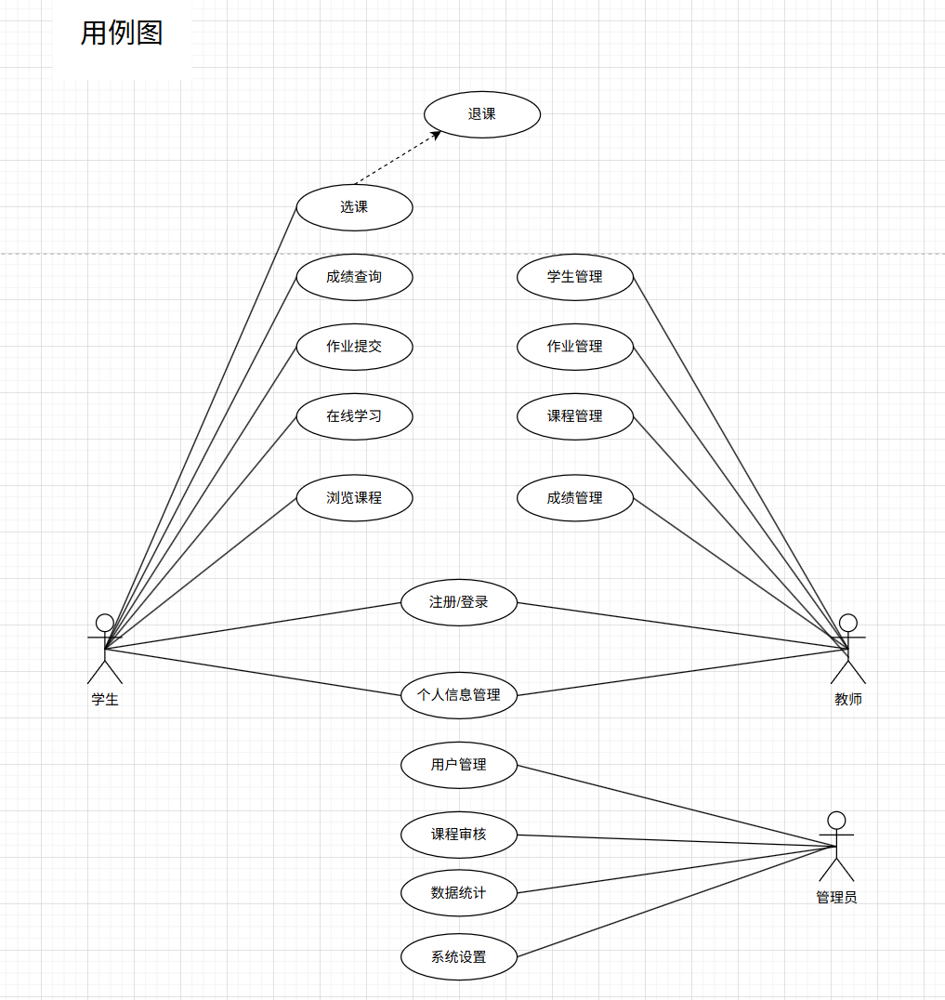
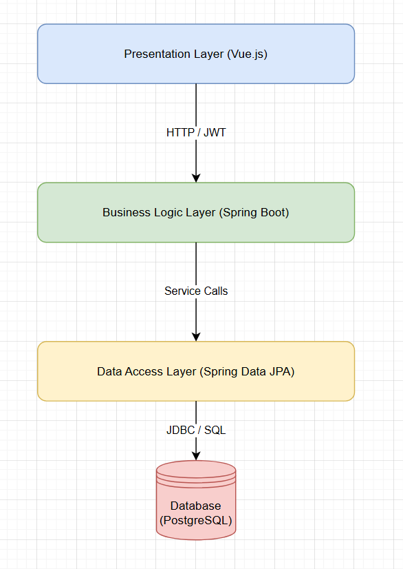
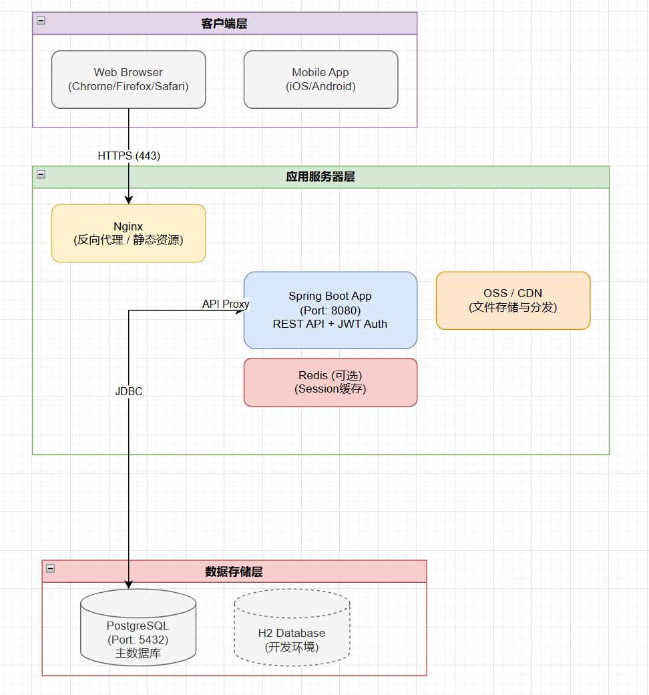
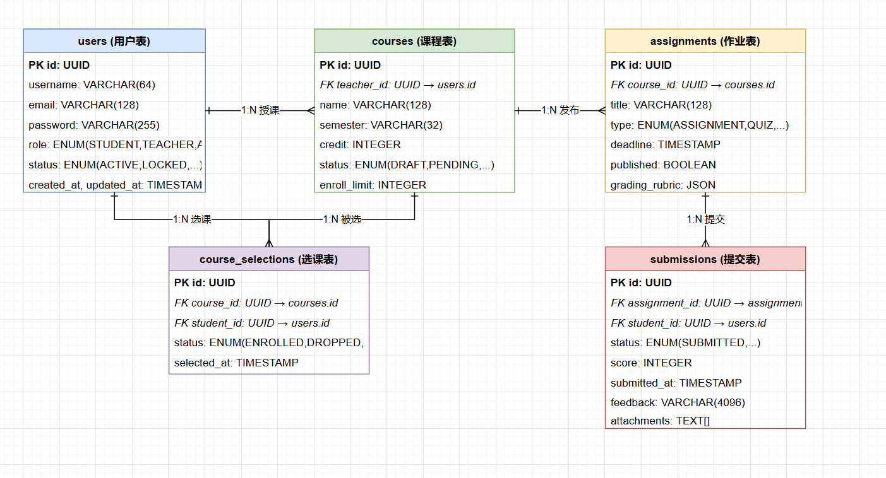
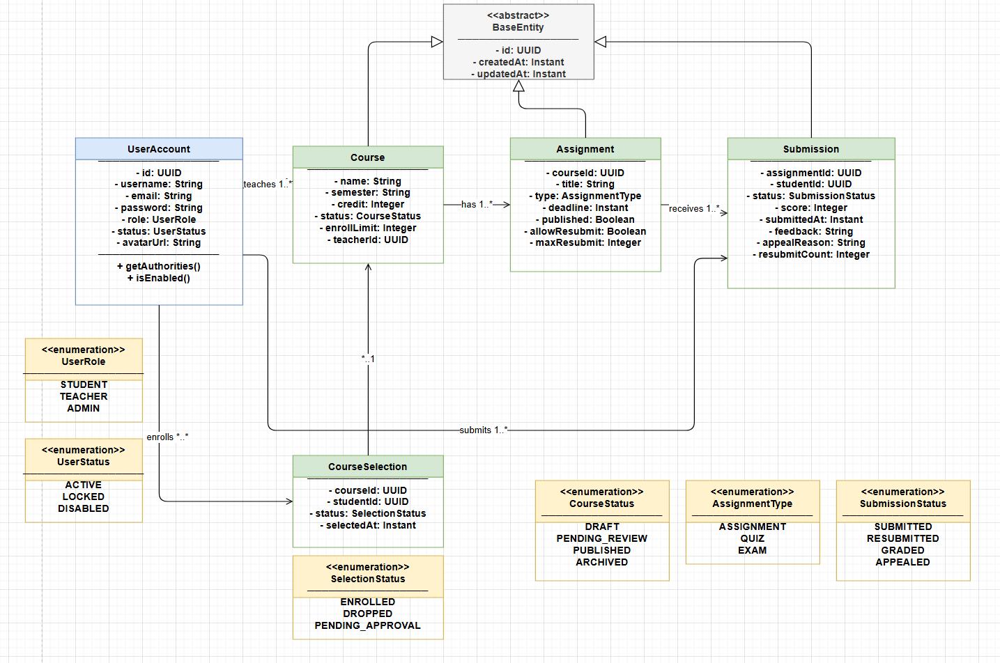
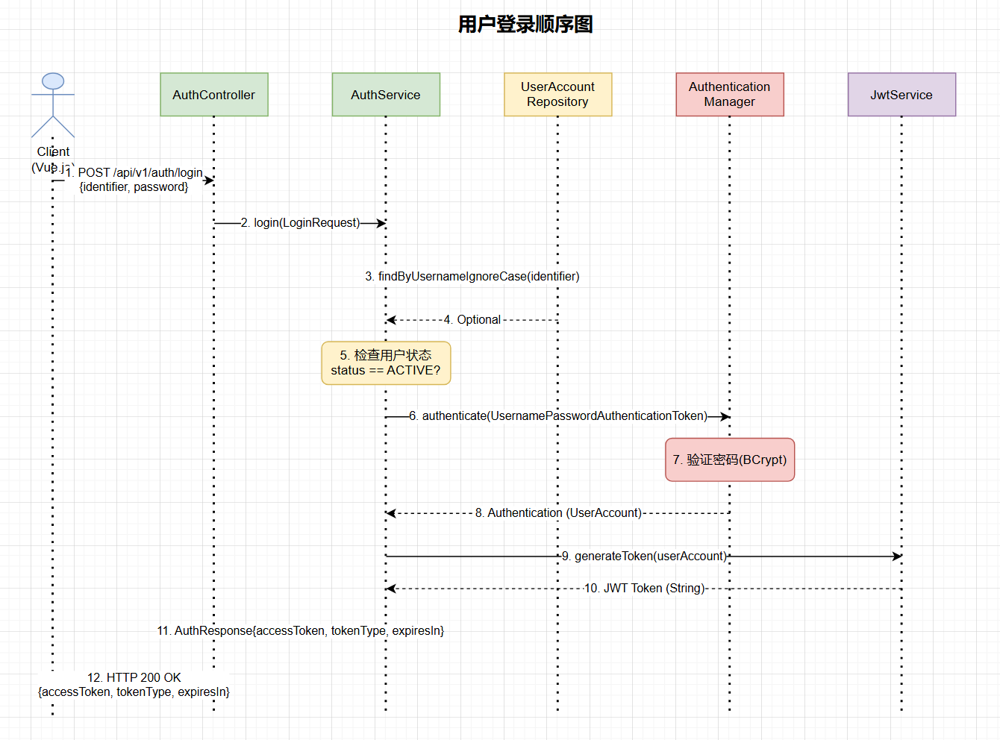
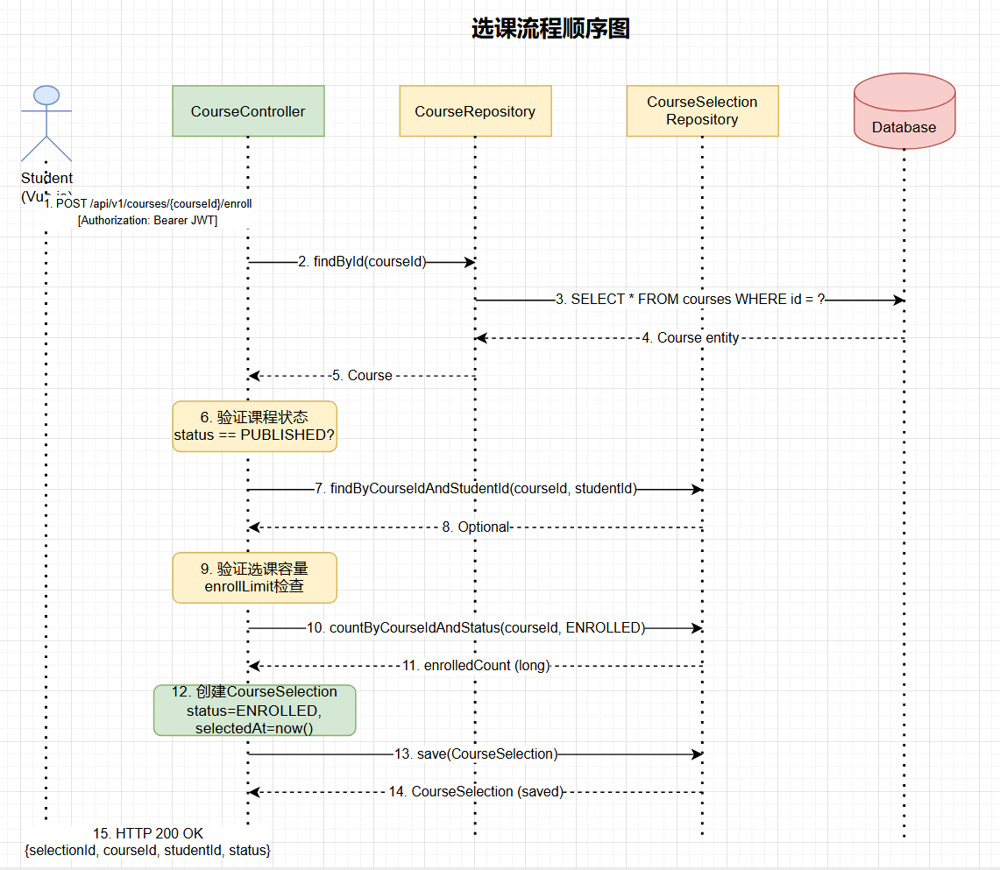
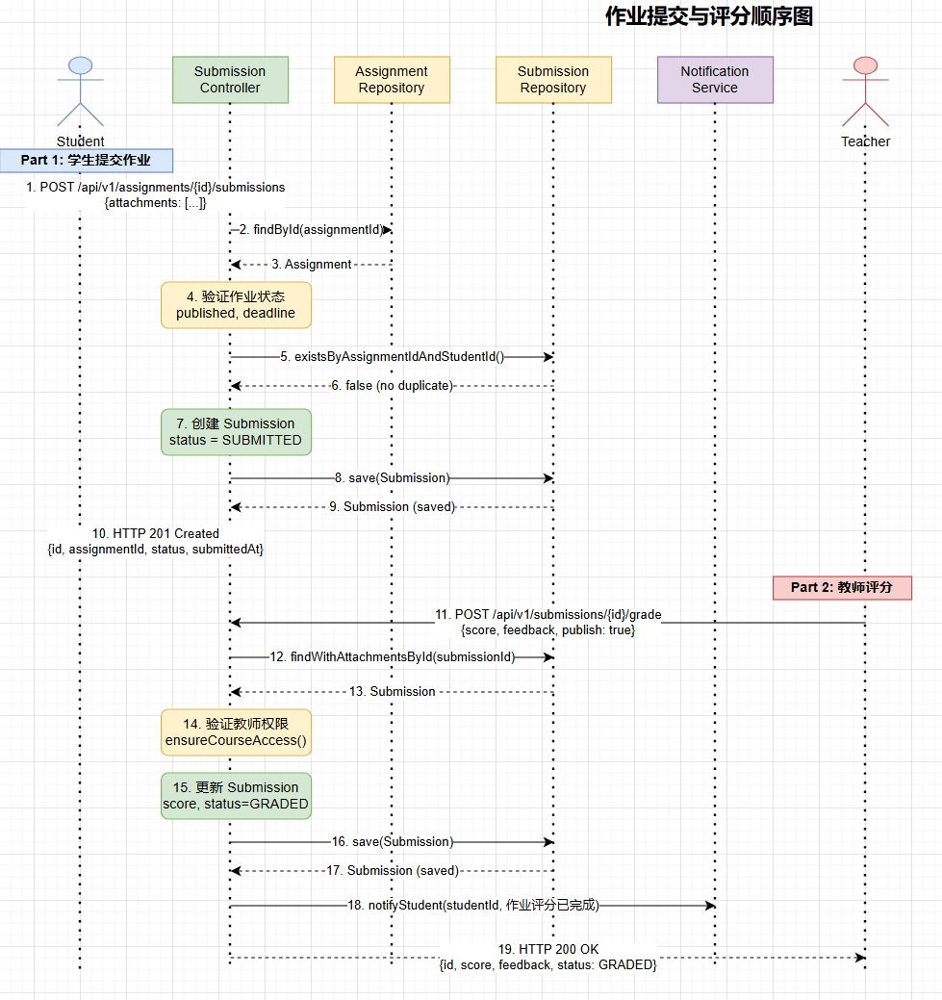
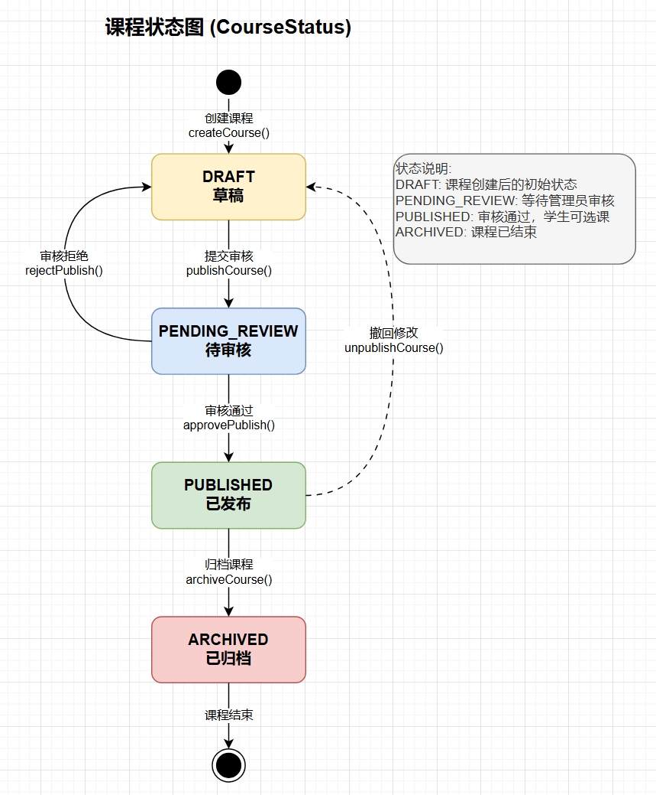
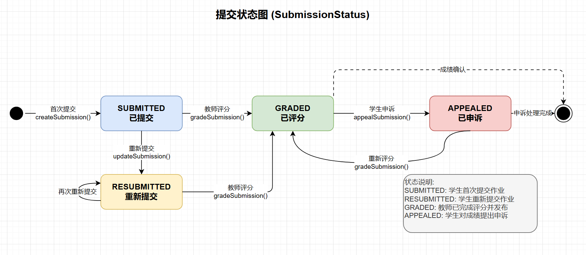

# 智慧学习平台项目交付报告

## 1. 摘要

智慧学习平台是一款面向高校"在线+混合式"教学场景的学习管理与教学协作平台，覆盖"选课—学习—作业—批改—成绩—分析—改进"的完整教学闭环。本项目采用前后端分离架构，基于Vue3、Spring Boot等主流技术栈开发，实现了学生、教师、管理员三大角色的全流程功能模块。

平台核心功能包括：学生端的课程学习、作业提交、成绩查询与智能辅助；教师端的课程管理、作业批改与教学数据分析；管理员端的用户治理、审批管理与数据统计。系统支持统一身份认证（SSO）、跨设备学习进度同步、AI智能答疑等先进特性，并提供完整的权限控制与审计机制，保障数据安全与合规。

项目成功实现了预期目标，建立了完整的教学数据链路，为学校数字化转型提供了有力支撑。通过可视化看板与报表能力，将教学活动沉淀为可度量、可优化的指标，帮助学校实现从经验驱动到数据驱动的转变。

## 2 项目背景

随着教育信息化2.0行动的深入推进，高校教学数字化已进入深化阶段。然而，当前高校教学系统仍存在"数据孤岛—重复劳动—治理失衡—体验不足"的结构性矛盾，严重制约了教学质量的提升和管理效率的优化。

### 2.1 现状问题分析

**信息割裂与数据孤岛**：选课、内容、作业、成绩等教学数据散落在多个独立系统中，数据口径不一致，形成"断点数据"。这导致无法建立统一的学习画像与课程质量评估链，难以支撑基于证据的教学改进。

**重复劳动与长反馈周期**：作业收发、批改、登记、导出的链路冗长，教师需要投入大量时间处理机械性工作。反馈周期被拉长，学生难以及时纠偏，课堂外的有效学习时间占比偏低。

**治理盲区与高成本**：管理端缺少可行动的数据看板、阈值告警与审计追踪机制，问题发现滞后，合规与安全压力增大，跨院系治理协同成本上升。

**学习体验割裂**：学生的任务不聚合、优先级不明确、进度不可视，学习动机与完成率承压，新生适应期过长，留存与通过率受到影响。

### 2.2 项目建设必要性

为解决上述问题，本项目以"学生为中心、数据为驱动、教学提效为目标"为原则，打造"待办—学习—提交—批改—分析—改进"的完整闭环。平台通过前后端分离与标准化接口将课程资源、学习过程数据与评价结果贯通，支持跨终端连续学习与状态同步，同时提供基于角色的权限与审计机制，保障数据安全与合规。

### 2.3 项目建设目标

本项目的核心目标包括：

**教学效率提升**：通过在线批注、评分标尺与批量评分等功能，使作业周转周期缩短≥30%，教师重复性操作时间下降≥40%。

**学习成效改善**：通过待办驱动、过程沉淀与结果可见等机制，使课程完成率提升≥10%，新生首学期留存提升≥15%。

**治理能力增强**：通过标准化报表、阈值告警与审计追踪，实现关键指标（访问性能、提交成功率、异常占比）可视化，重要事件T+1出具周/月报表。

通过本项目的实施，将为学校构建一个功能完善、体验优良、安全可靠的智慧学习平台，为教育教学改革提供强有力的技术支撑。

## 3. 需求分析

### 3.1 功能需求

#### 3.1.1 学生端功能界面要求

1. **平台主入口页面**：用户可以根据自身的实际需求，选择不同的登录入口，从而进入相应端的登录页面。具体来说，用户可以通过点击"学生登录"按钮，跳转至学生用户登录入口页面；点击"教师登录"按钮，跳转至教师登录入口页面；点击"管理员登录"按钮，跳转至学校管理员登录入口页面，以便不同角色的用户能够便捷地进入系统。

2. **学生登录/注册页面**：该页面专门为学生用户提供登录入口，学生可以通过输入学号作为账号，结合密码完成学生端的登录操作。此外，该页面还提供了账号注册按钮，方便新用户进行注册，同时也设有返回主页面按钮，方便用户在需要时返回主入口页面。系统支持统一身份认证（SSO），允许学生使用学校统一账号登录。

3. **学生端仪表盘页面**：该页面是学生用户的主要操作界面，主要显示学生已选课程的数量、待完成的作业数量、未学习的章节数量、未读公告数量、近期作业截止时间以及学习进度概览。同时，页面还提供了课程广场、我的课程、作业中心、成绩查询、消息中心等快捷入口，方便学生快速进行相关操作。顶部导航栏设有"我的主页（仪表盘）""课程广场""我的课程""作业中心""成绩查询""消息中心""个人中心"及"退出登录"按钮，以便学生进行页面切换和功能操作。

4. **课程广场与详情页面**：该页面展示全校所有可选课程的名片信息，支持学生通过搜索功能查找对应课程。学生可以依据专业、学期、课程类型以及课程难度进行筛选或搜索，快速找到感兴趣的课程。系统会自动检查选课名额是否已满、是否与其他已选课程时间冲突，并给出明确提示。点击课程卡片可直接查看课程详情（包括课程介绍、授课教师信息、课程大纲、学习资源列表以及最近课程公告）并进行选课操作。

5. **智能课程学习页面**：该页面展示课程章节列表、视频播放器、课件预览区、学习笔记区以及讨论区。学生可以在线播放课程视频（支持倍速、清晰度切换、章节跳转、断点续播），在线预览PDF/课件并可下载，在学习过程中记录带时间戳的笔记。学习进度与笔记会自动在不同设备间同步。**AI功能增强**：提供AI学习助手，支持智能答疑、知识点总结功能。

6. **作业与测验中心页面**：该页面整合了作业和测验功能，显示学生所有已选课程的作业和测验列表，支持按课程、状态（待提交/已提交/已批改/待参与/已参与）筛选。页面显示作业/测验标题、所属课程、截止时间、提交状态等信息。点击进入可查看详情并进行提交或参与。支持文件上传、文本输入和链接提交，允许在截止前重复提交（以最后一次为准）。测验支持单选、多选、填空、简答等多种题型。

7. **成绩查询与申诉页面**：该页面展示学生的课程成绩构成（平时分/作业/考试）、成绩趋势图与分布图，支持按课程、学期筛选。学生可以查看每门课程的详细成绩，包括各项作业和测验的得分情况。页面提供成绩单导出功能（Excel/PDF格式），并集成成绩申诉功能，学生可直接在此页面发起申诉，填写申诉理由、上传相关证据，并跟踪申诉处理进度和结果。

8. **消息与通知中心页面**：该页面集中显示所有课程公告、作业提醒、成绩发布通知与系统通知，支持按课程、类型（公告/提醒/通知）筛选。重要提醒可选择同步到邮件/短信。学生可以标记消息为已读或未读，删除不需要的消息。

9. **个人中心页面**：该页面支持学生编辑个人信息（头像、联系方式、专业、年级等）、修改密码、查看历史登录设备、管理隐私设置和提醒偏好。学生可以查看自己的学习统计数据，包括总学习时长、完成作业数、获得积分等。

#### 3.1.2 教师端功能界面要求

10. **教师登录页面**：该页面为教师用户提供登录入口，教师通过输入工号作为账号，结合密码进行教师端的登录。页面提供返回主页面按钮，但不提供账号注册按钮，以确保系统的安全性和管理权限的严格控制。系统支持统一身份认证（SSO）。

11. **教师端仪表盘页面**：该页面显示教师当前授课课程数量、待批改作业数量、待审批活动申请数量、课程总学生数、近期课程公告等核心数据。页面提供创建课程、发布作业、批改作业、查看统计等快捷入口，方便教师快速进行相关操作。顶部导航栏设有"我的主页（仪表盘）""课程管理""作业管理""学生管理""统计分析""个人中心"及"退出登录"按钮。

12. **课程与资源管理页面**：该功能模块整合了课程管理和资源管理功能，允许教师创建新课程、编辑已有课程信息、配置学期、授课班级、助教、开课时间等基本信息，支持从以往课程一键复用大纲与资源。同时支持批量上传视频/课件等学习资源，系统会自动转码与生成预览。教师可以设置资源的可见范围以及发布时间，管理资源的分类和标签，对资源进行编辑、删除等操作。

13. **作业与测验管理页面**：该功能模块整合了作业管理和测验管理功能，允许教师基于模板快速创建作业和测验，设置作业/测验要求、评分标准、截止时间等信息。教师可以配置防抄袭提示、允许重提交次数、迟交扣分规则等选项。同时提供作业收集与监控功能，实时查看作业提交率、逾期率、格式异常与可疑重复等情况，并支持在线批注作业，按评分标尺打分，使用模板评语快速反馈。

14. **学生管理与成绩页面**：该功能模块整合了学生管理和成绩管理功能，允许教师查看每个班级/小组的学生列表、学习进度与作业完成度，对"明显落后"的学生一键发送提醒。教师可以查看和编辑学生成绩，按时间或条件批量发布成绩，导出成绩与评语汇总。可以查看成绩分布、平均分等统计信息。

15. **教师个人中心页面**：该页面支持教师编辑个人信息（头像、联系方式等）、修改密码、查看历史登录设备、管理隐私设置和提醒偏好。

#### 3.1.3 管理员端功能界面要求

16. **管理员登录页面**：该页面为学校管理员提供登录入口，学校管理员通过输入管理员账号作为账号，结合密码进行管理员端的登录。页面提供返回主页面按钮，但不提供账号注册按钮，以确保系统的安全性和管理权限的严格控制。

17. **管理员端仪表盘页面**：该页面显示平台当前的用户总数、课程总数、活跃用户数、待审批事项数量、系统访问性能指标等核心数据。页面提供用户管理、课程管理、审批管理、数据统计等快捷入口，方便管理员快速进行相关操作。顶部导航栏设有"我的主页（仪表盘）""用户管理""课程管理""审批管理""数据统计""系统设置""审计日志"及"退出登录"按钮。

18. **用户与组织管理页面**：该功能模块整合了用户管理和组织管理功能，允许学校管理员对用户进行管理，包括新增/停用用户、重置密码、分配角色（学生/教师/管理员）、批量导入导出用户信息并自动校验模板格式。同时支持管理院系、班级等组织信息，同步院系与班级信息，支持批量导入导出组织数据。管理员可以按学院、年级、角色筛选用户，查看用户详细信息，管理用户权限。

### 3.2 用例图



### 3.2 用例文档

**a. 学生用户用例描述**

**1. 登录入口**

- **参与者**：学生、教师、学校管理员
- **描述**：用户根据角色选择相应的登录入口
- **前置条件**：用户访问平台主入口页面
- **后置条件**：进入对应角色的登录页面
- **基本流程**：
  1. 系统显示主入口页面
  2. 用户点击相应角色登录按钮（学生登录/教师登录/管理员登录）
  3. 系统跳转到对应登录页面

**2. 学生注册与登录**

- **参与者**：学生
- **描述**：学生用户注册或登录系统
- **前置条件**：学生访问学生登录/注册页面
- **后置条件**：注册成功或登录进入学生端仪表盘
- **基本流程**：
  1. 学生访问学生登录/注册页面
  2. 如需注册，点击注册按钮并填写注册信息（学号、姓名、密码、邮箱、专业、年级等）
  3. 系统验证信息合法性（学号唯一性、密码强度等）
  4. 系统创建账号并提示注册成功
  5. 学生输入学号和密码进行登录
  6. 系统验证凭据（支持统一认证SSO）
  7. 登录成功，进入学生端仪表盘

**3. 浏览仪表盘**

- **参与者**：学生
- **描述**：查看个人数据和快捷入口
- **前置条件**：学生已登录
- **后置条件**：显示个人概览信息
- **基本流程**：
  1. 系统显示已选课程数量
  2. 显示待完成作业数量
  3. 显示未学习章节数量
  4. 显示未读公告数量
  5. 显示近期作业截止时间
  6. 显示学习进度概览
  7. 提供课程广场、我的课程、作业中心等快捷入口

**4. 选课**

- **参与者**：学生
- **描述**：学生选择课程
- **前置条件**：学生已登录，处于选课期间
- **后置条件**：课程添加到学生课程列表
- **基本流程**：
  1. 学生进入课程广场页面
  2. 学生按专业、学期、关键词搜索课程
  3. 系统返回符合条件的课程列表
  4. 学生点击课程查看详情
  5. 学生点击选课按钮
  6. 系统检查名额是否已满
  7. 系统检查时间是否冲突
  8. 系统显示选课确认页面
  9. 学生确认选课
  10. 系统记录选课信息并更新课表

**5. 学习课程内容**

- **参与者**：学生
- **描述**：学生在线学习课程视频和资料
- **前置条件**：学生已登录，已选该课程
- **后置条件**：更新学习进度和笔记
- **基本流程**：
  1. 学生进入课程学习页面
  2. 学生选择要学习的章节
  3. 系统加载视频或资料
  4. 学生播放视频（支持倍速、清晰度切换）
  5. 学生记录学习笔记（带时间戳）
  6. 系统自动保存播放进度
  7. 系统自动保存笔记内容
  8. 学习进度和笔记在不同设备间同步

**6. 提交作业**

- **参与者**：学生
- **描述**：学生提交作业
- **前置条件**：学生已登录，作业未截止
- **后置条件**：作业提交成功，生成回执编号
- **基本流程**：
  1. 学生进入作业详情页面
  2. 学生查看作业要求、截止时间、评分标准
  3. 学生上传作业文件或输入文本内容
  4. 系统检查文件格式和大小
  5. 系统进行病毒扫描
  6. 学生确认提交
  7. 系统保存提交记录
  8. 系统生成提交回执编号
  9. 系统更新作业状态为"已提交"

**7. 查看成绩**

- **参与者**：学生
- **描述**：学生查看课程成绩
- **前置条件**：学生已登录，成绩已发布
- **后置条件**：显示成绩信息
- **基本流程**：
  1. 学生进入成绩查询页面
  2. 学生选择要查看的课程
  3. 系统显示成绩构成（平时分/作业/考试）
  4. 系统显示成绩趋势图和分布图
  5. 学生可以查看详细成绩明细
  6. 学生可以导出成绩单（PDF/Excel）

**8. 修改个人数据**

- **参与者**：学生
- **描述**：学生修改个人信息
- **前置条件**：学生已登录
- **后置条件**：显示修改成功，个人信息同步更新
- **基本流程**：
  1. 学生进入个人信息页面
  2. 学生点击修改个人信息
  3. 系统显示可修改的个人信息
  4. 学生选择想修改的信息并进行修改
  5. 系统提示修改成功
  6. 系统更新个人信息

**b. 教师用户用例描述**

**1. 教师登录**

- **参与者**：教师
- **描述**：教师用户登录系统
- **前置条件**：教师有有效账号
- **后置条件**：进入教师端仪表盘
- **基本流程**：
  1. 教师输入工号和密码
  2. 系统验证凭据（支持统一认证SSO）
  3. 登录成功，进入教师端仪表盘

**2. 创建课程**

- **参与者**：教师
- **描述**：教师创建新课程
- **前置条件**：教师已登录
- **后置条件**：创建新课程记录
- **基本流程**：
  1. 教师进入课程管理页面
  2. 教师点击创建课程按钮
  3. 教师填写课程基本信息（课程名称、学期、授课班级、助教等）
  4. 教师设置课程可见范围和开课时间
  5. 教师可以选择从以往课程复用大纲和资源
  6. 教师保存课程信息
  7. 系统创建课程并生成课程主页

**3. 发布作业**

- **参与者**：教师
- **描述**：教师发布作业给学生
- **前置条件**：教师已登录，已创建课程
- **后置条件**：作业发布成功，学生收到提醒
- **基本流程**：
  1. 教师进入作业管理页面
  2. 教师点击创建作业按钮
  3. 教师基于模板填写作业要求
  4. 教师设置评分标准和截止时间
  5. 教师配置作业选项（防抄袭提示、允许重提交次数、迟交扣分等）
  6. 教师选择作业适用的班级
  7. 教师发布作业
  8. 系统生成作业链接
  9. 系统自动提醒选课学生
  10. 系统在学生端生成待办事项

**4. 批改作业**

- **参与者**：教师
- **描述**：教师批改学生提交的作业
- **前置条件**：教师已登录，学生已提交作业
- **后置条件**：作业评分完成，学生可查看成绩
- **基本流程**：
  1. 教师进入作业批改页面
  2. 教师查看学生提交的作业内容
  3. 教师在网页上直接批注作业
  4. 教师按评分标尺打分
  5. 教师使用模板评语或自定义评语
  6. 教师保存评分和评语
  7. 系统记录批改操作（谁在什么时候改了什么）
  8. 系统更新作业状态为"已批改"
  9. 系统通知学生查看批改结果

**5. 查看学习分析**

- **参与者**：教师
- **描述**：教师查看学生学习数据分析
- **前置条件**：教师已登录，有授课课程
- **后置条件**：显示学习分析结果
- **基本流程**：
  1. 教师进入学习分析页面
  2. 教师选择要分析的课程
  3. 系统生成章节到课率统计
  4. 系统生成进度滞后学生名单
  5. 系统生成题目易错点分析
  6. 系统生成作业难度系数统计
  7. 系统显示可视化图表
  8. 教师可以一键向滞后学生发送提醒

**6. 修改个人数据**

- **参与者**：教师
- **描述**：教师修改个人信息
- **前置条件**：教师已登录
- **后置条件**：显示修改成功，个人信息同步更新
- **基本流程**：
  1. 教师进入个人信息页面
  2. 教师点击修改个人信息
  3. 系统显示可修改的个人信息
  4. 教师选择想修改的信息并进行修改
  5. 系统提示修改成功
  6. 系统更新个人信息

**c. 管理员用户用例描述**

**1. 管理员登录**

- **参与者**：学校管理员
- **描述**：学校管理员登录系统
- **前置条件**：管理员有有效账号
- **后置条件**：进入管理员端仪表盘
- **基本流程**：
  1. 管理员输入账号和密码
  2. 系统验证凭据
  3. 登录成功，进入管理员端仪表盘

**2. 用户管理**

- **参与者**：学校管理员
- **描述**：管理员管理用户信息
- **前置条件**：管理员已登录
- **后置条件**：用户信息更新完成
- **基本流程**：
  1. 管理员进入用户管理页面
  2. 管理员可以新增用户、停用用户、重置密码
  3. 管理员可以批量导入用户信息
  4. 系统自动校验模板格式
  5. 系统显示导入结果（成功/失败数量）
  6. 管理员可以分配用户角色和权限
  7. 系统更新用户信息并记录操作日志

**3. 课程审批**

- **参与者**：学校管理员
- **描述**：管理员审批课程相关内容
- **前置条件**：管理员已登录，有待审批事项
- **后置条件**：审批完成，记录审批结果
- **基本流程**：
  1. 管理员进入审批管理页面
  2. 管理员查看待审批事项列表
  3. 管理员点击查看审批详情
  4. 管理员查看相关内容（课程信息、活动信息等）
  5. 管理员选择通过或驳回
  6. 管理员填写审批意见（如需要）
  7. 系统记录审批结果
  8. 系统通知相关教师审批结果

**4. 数据统计**

- **参与者**：学校管理员
- **描述**：管理员查看平台数据统计
- **前置条件**：管理员已登录
- **后置条件**：显示统计数据
- **基本流程**：
  1. 管理员进入数据统计页面
  2. 管理员选择统计维度（时间范围、学院、课程等）
  3. 系统生成用户规模统计
  4. 系统生成课程数量统计
  5. 系统生成提交成功率统计
  6. 系统生成访问性能指标
  7. 系统显示可视化图表
  8. 管理员可以导出统计报表

## 4. 概要设计

### 4.1 架构图



#### 4.1.1 架构说明

智慧学习平台采用经典的**三层 MVC 架构**，结合 Spring Boot 的分层设计模式：

| 层次 | 技术选型 | 职责说明 |
| :--- | :--- | :--- |
| **表现层 (Presentation)** | Vue.js 3.x + TypeScript | 负责用户界面展示与交互，通过 HTTPS 与后端 REST API 通信 |
| **业务逻辑层 (Business Logic)** | Spring Boot 3.5.7 + Spring Security | 实现核心业务逻辑、JWT 认证授权、事务管理 |
| **数据访问层 (Data Access)** | Spring Data JPA + Hibernate | 提供 ORM 映射与数据 CRUD 操作，屏蔽底层数据库差异 |
| **持久层 (Persistence)** | PostgreSQL / H2 | 生产环境使用 PostgreSQL，开发测试使用 H2 内存数据库 |

#### 4.1.2 核心技术栈

- **后端框架**：Spring Boot 3.5.7 (LTS)
- **安全框架**：Spring Security + JWT (JSON Web Token)
- **数据访问**：Spring Data JPA + Jakarta Persistence API
- **构建工具**：Gradle
- **前端框架**：Vue.js 3.x + TypeScript + Vite
- **HTTP 客户端**：Axios

### 4.2 部署图



#### 4.2.1 部署架构说明

系统采用典型的 Web 应用部署架构，包含以下组件：

| 组件 | 说明 | 端口 |
| :--- | :--- | :--- |
| **Nginx** | 反向代理服务器，托管前端静态资源，转发 API 请求至后端 | 80 / 443 |
| **Spring Boot App** | 后端应用服务，提供 REST API 接口 | 8080 |
| **PostgreSQL** | 关系型数据库，存储所有业务数据 | 5432 |
| **OSS / CDN** | 对象存储服务，用于存储课件、视频等大文件 | - |
| **Redis (可选)** | 缓存服务，用于 Session 缓存与热点数据缓存 | 6379 |

#### 4.2.2 环境配置

| 环境 | 数据库 | Profile | 说明 |
| :--- | :--- | :--- | :--- |
| **开发环境** | H2 (内存) | `local` | 快速启动，无需外部依赖 |
| **测试环境** | PostgreSQL | `test` | 模拟生产环境进行集成测试 |
| **生产环境** | PostgreSQL | `prod` | 正式部署，启用完整安全配置 |

### 4.3 功能模块

系统按照业务领域划分为以下核心功能模块：

#### 4.3.1 模块总览

```
┌────────────────────────────────────────────────────────────────┐
│                        C3PO 智慧学习平台                         │
├────────────────────────────────────────────────────────────────┤
│  ┌──────────────┐  ┌──────────────┐  ┌──────────────────────┐  │
│  │  认证与权限    │  │  课程管理     │  │  作业与提交管理        │  │
│  │  Module      │  │  Module      │  │  Module              │  │
│  └──────────────┘  └──────────────┘  └──────────────────────┘  │
│  ┌──────────────┐  ┌──────────────┐  ┌──────────────────────┐  │
│  │  成绩与分析    │  │  通知与消息   │  │  系统管理与审批         │  │
│  │  Module      │  │  Module      │  │  Module              │  │
│  └──────────────┘  └──────────────┘  └──────────────────────┘  │
└────────────────────────────────────────────────────────────────┘
```

#### 4.3.2 模块详细说明

| 模块名称 | 核心功能 | 涉及实体 |
| :--- | :--- | :--- |
| **认证与权限模块** | 用户注册、登录、JWT Token 生成与验证、角色权限校验 (STUDENT/TEACHER/ADMIN) | `UserAccount`, `StudentProfile`, `TeacherProfile` |
| **课程管理模块** | 课程创建/编辑、课程发布审核、课程资源上传、选课/退课管理 | `Course`, `CourseModule`, `CourseResource`, `CourseSelection` |
| **作业与提交模块** | 作业发布、学生在线提交、教师在线批改、评分与反馈 | `Assignment`, `Submission`, `QuizAttempt` |
| **成绩与分析模块** | 成绩录入、成绩查询、成绩分布统计、学习数据分析 | `Score`, `Submission` |
| **通知与消息模块** | 系统通知推送、作业提醒、成绩发布通知 | `Notification` |
| **系统管理模块** | 用户管理、审批流程、系统设置、报表生成 | `ApprovalRequest`, `SystemSettings`, `ReportJob` |

#### 4.3.3 后端包结构

```
fin.c3po/
├── auth/           # 认证模块 (AuthController, AuthService, JwtService)
├── user/           # 用户管理 (UserAccount, UserAccountRepository)
├── profile/        # 用户档案 (StudentProfile, TeacherProfile)
├── course/         # 课程管理 (Course, CourseModule, CourseResource)
├── selection/      # 选课管理 (CourseSelection)
├── assignment/     # 作业管理 (Assignment)
├── submission/     # 提交管理 (Submission, QuizAttempt)
├── score/          # 成绩管理 (Score)
├── notify/         # 通知模块 (Notification)
├── approval/       # 审批模块 (ApprovalRequest)
├── report/         # 报表模块 (ReportJob)
├── system/         # 系统设置 (SystemSettings)
├── assistant/      # AI 助手 (AiConversation, AiMessage)
└── common/         # 公共组件 (ApiResponse, GlobalExceptionHandler)
```

### 4.4 数据库设计

#### 4.4.1 ER 图



#### 4.4.2 核心实体关系

```
UserAccount (1) ──────┬──────── (N) Course           教师授课
                      │
                      └──────── (N) CourseSelection  学生选课

Course (1) ───────────┬──────── (N) CourseModule     课程章节
                      │
                      ├──────── (N) CourseResource   课程资源
                      │
                      └──────── (N) Assignment       课程作业

Assignment (1) ───────────────── (N) Submission      作业提交

Submission (1) ───────────────── (1) Score           提交评分
```

#### 4.4.3 核心数据表结构

##### users (用户账户表)

| 字段名 | 类型 | 约束 | 说明 |
| :--- | :--- | :--- | :--- |
| `id` | UUID | PK | 主键 |
| `username` | VARCHAR(64) | UNIQUE, NOT NULL | 用户名/学号/工号 |
| `email` | VARCHAR(128) | UNIQUE, NOT NULL | 邮箱地址 |
| `password` | VARCHAR(255) | NOT NULL | BCrypt 加密密码 |
| `role` | VARCHAR(32) | NOT NULL | 角色枚举: STUDENT, TEACHER, ADMIN |
| `status` | VARCHAR(32) | NOT NULL | 状态枚举: ACTIVE, LOCKED, DISABLED |
| `status_reason` | VARCHAR(512) | | 状态变更原因 |
| `created_at` | TIMESTAMP | | 创建时间 |
| `updated_at` | TIMESTAMP | | 更新时间 |

##### courses (课程表)

| 字段名 | 类型 | 约束 | 说明 |
| :--- | :--- | :--- | :--- |
| `id` | UUID | PK | 主键 |
| `name` | VARCHAR(128) | NOT NULL | 课程名称 |
| `semester` | VARCHAR(32) | | 学期 (如: 2025-春季) |
| `credit` | INTEGER | | 学分 |
| `status` | VARCHAR(32) | NOT NULL | 状态: DRAFT, PENDING_REVIEW, PUBLISHED, ARCHIVED |
| `enroll_limit` | INTEGER | | 选课人数上限 |
| `teacher_id` | UUID | FK → users.id | 授课教师 ID |
| `created_at` | TIMESTAMP | | 创建时间 |
| `updated_at` | TIMESTAMP | | 更新时间 |

##### assignments (作业表)

| 字段名 | 类型 | 约束 | 说明 |
| :--- | :--- | :--- | :--- |
| `id` | UUID | PK | 主键 |
| `course_id` | UUID | FK → courses.id | 所属课程 ID |
| `title` | VARCHAR(128) | NOT NULL | 作业标题 |
| `type` | VARCHAR(32) | NOT NULL | 类型: ASSIGNMENT, QUIZ, PROJECT |
| `deadline` | TIMESTAMP | | 截止时间 |
| `release_at` | TIMESTAMP | | 发布时间 |
| `published` | BOOLEAN | | 是否已发布 |
| `allow_resubmit` | BOOLEAN | | 是否允许重新提交 |
| `max_resubmit` | INTEGER | | 最大重提交次数 |
| `grading_rubric` | VARCHAR(4096) | | 评分标准 (JSON) |
| `created_at` | TIMESTAMP | | 创建时间 |
| `updated_at` | TIMESTAMP | | 更新时间 |

##### submissions (提交表)

| 字段名 | 类型 | 约束 | 说明 |
| :--- | :--- | :--- | :--- |
| `id` | UUID | PK | 主键 |
| `assignment_id` | UUID | FK → assignments.id | 所属作业 ID |
| `student_id` | UUID | FK → users.id | 提交学生 ID |
| `status` | VARCHAR(32) | NOT NULL | 状态: SUBMITTED, RESUBMITTED, GRADED, APPEALED |
| `score` | INTEGER | | 得分 |
| `submitted_at` | TIMESTAMP | | 提交时间 |
| `attachments` | TEXT[] | | 附件列表 |
| `feedback` | VARCHAR(4096) | | 教师反馈 |
| `rubric_scores` | VARCHAR(2048) | | 评分细项 (JSON) |
| `appeal_reason` | VARCHAR(2048) | | 申诉理由 |
| `appealed_at` | TIMESTAMP | | 申诉时间 |
| `grading_teacher_id` | UUID | FK → users.id | 批改教师 ID |
| `resubmit_count` | INTEGER | | 重提交次数 |
| `created_at` | TIMESTAMP | | 创建时间 |
| `updated_at` | TIMESTAMP | | 更新时间 |

##### course_selections (选课表)

| 字段名 | 类型 | 约束 | 说明 |
| :--- | :--- | :--- | :--- |
| `id` | UUID | PK | 主键 |
| `course_id` | UUID | FK → courses.id | 课程 ID |
| `student_id` | UUID | FK → users.id | 学生 ID |
| `status` | VARCHAR(32) | NOT NULL | 状态: ENROLLED, DROPPED, PENDING_APPROVAL |
| `selected_at` | TIMESTAMP | | 选课时间 |
| `created_at` | TIMESTAMP | | 创建时间 |
| `updated_at` | TIMESTAMP | | 更新时间 |

#### 4.4.4 其他重要数据表

| 表名 | 说明 |
| :--- | :--- |
| `student_profiles` | 学生详细信息 (学号、年级、专业、班级) |
| `teacher_profiles` | 教师详细信息 (工号、职称、研究方向) |
| `course_modules` | 课程章节/模块 |
| `course_resources` | 课程资源 (视频、文档、链接) |
| `scores` | 成绩记录 (支持多维度成绩构成) |
| `notifications` | 系统通知与消息 |
| `approval_requests` | 审批请求 (课程发布审批等) |
| `system_settings` | 系统配置参数 |
| `report_jobs` | 异步报表任务 |

## 5. 详细设计

### 5.1 类图


### 5.2 顺序图

#### 5.2.1 用户登录流程


#### 5.2.2 选课流程


#### 5.2.3 作业提交与评分流程


### 5.3 状态图

#### 5.3.1 课程状态转换


#### 5.3.2 提交状态转换


## 6. 系统实现

### 6.1 系统界面截图

本系统提供三类用户角色的独立界面：学生端、教师端和管理员端。以下展示各角色的核心界面设计。

#### 6.1.1 登录首页


系统首页采用简洁的卡片式设计，提供三个角色入口：
- **学生登录**：供在校学生访问个人学习资源
- **教师登录**：供任课教师管理课程和批改作业
- **管理员登录**：供系统管理员进行用户和权限管理

#### 6.1.2 学生端界面

##### 学生登录页


学生使用学号和密码登录系统，支持"记住我"功能和密码找回。

##### 学生仪表盘


学生仪表盘集中展示：
- **待办事项**：即将到期的作业和考试提醒
- **课程列表**：已选修的全部课程及学习进度
- **最近通知**：来自教师和系统的重要消息
- **成绩概览**：各科目成绩统计图表

主要功能包括：课程选修、作业提交、成绩查询、课程讨论、个人资料

#### 6.1.3 教师端界面

##### 教师登录页


教师使用工号和密码登录，首次登录需完成注册流程。

##### 教师仪表盘


教师仪表盘提供：
- **课程管理**：创建、编辑和归档课程
- **作业管理**：发布作业、设置截止日期、批量批改
- **学生名单**：查看选课学生信息
- **成绩录入**：在线打分并发布成绩

主要功能入口包括：课程详情管理、作业批改、成绩管理、学生列表

#### 6.1.4 管理员端界面

##### 管理员登录页


管理员使用管理账号登录后台管理系统。

##### 管理员仪表盘


管理员界面提供全局系统管理功能：
- **用户管理**：创建、禁用用户账号，分配角色
- **课程审核**：审批新开设的课程
- **系统设置**：配置全局参数
- **统计报表**：查看系统使用数据

#### 6.1.5 通用页面

系统还包含以下通用页面：
- **404 错误页**：处理页面不存在的情况
- **无权限页**：处理权限不足的访问

---

### 6.2 关键代码实现

#### 6.2.1 后端：JWT 令牌服务 (JwtService.java)

`JwtService` 负责 JWT 令牌的生成、解析和验证，是系统认证机制的核心组件。

**核心功能：**
- 使用 HMAC-SHA256 算法签名令牌
- 支持自定义过期时间
- 提供令牌有效性验证

```java
@Service
public class JwtService {

    private final SecretKey secretKey;
    private final long expirationMs;

    public JwtService(
            @Value("${security.jwt.secret}") String secret,
            @Value("${security.jwt.expiration-ms:3600000}") long expirationMs
    ) {
        if (secret == null || secret.length() < 32) {
            throw new IllegalArgumentException("JWT secret must be at least 32 characters");
        }
        this.secretKey = Keys.hmacShaKeyFor(secret.getBytes(StandardCharsets.UTF_8));
        this.expirationMs = expirationMs;
    }

    public String generateToken(Map<String, Object> extraClaims, UserDetails userDetails) {
        Instant now = Instant.now();
        return Jwts.builder()
                .claims(extraClaims)
                .subject(userDetails.getUsername())
                .issuedAt(Date.from(now))
                .expiration(Date.from(now.plusMillis(expirationMs)))
                .signWith(secretKey)
                .compact();
    }

    public boolean isTokenValid(String token, UserDetails userDetails) {
        final String username = extractUsername(token);
        return username.equalsIgnoreCase(userDetails.getUsername()) && !isTokenExpired(token);
    }

    private boolean isTokenExpired(String token) {
        return extractExpiration(token).isBefore(Instant.now());
    }
}
```

**设计要点：**
1. 密钥长度校验：确保至少 32 字符，满足 HMAC-SHA256 安全要求
2. 配置化过期时间：通过 `@Value` 注入，便于不同环境配置
3. 支持扩展声明：`extraClaims` 参数允许添加自定义信息（如角色、权限）

---

#### 6.2.2 后端：JWT 认证过滤器 (JwtAuthenticationFilter.java)

`JwtAuthenticationFilter` 在每个 HTTP 请求到达 Controller 前执行，负责提取并验证 JWT 令牌。

```java
@Slf4j
@RequiredArgsConstructor
public class JwtAuthenticationFilter extends OncePerRequestFilter {

    private final JwtService jwtService;
    private final UserDetailsService userDetailsService;

    @Override
    protected void doFilterInternal(
            @NonNull HttpServletRequest request,
            @NonNull HttpServletResponse response,
            @NonNull FilterChain filterChain) throws ServletException, IOException {
        
        final String authHeader = request.getHeader(HttpHeaders.AUTHORIZATION);

        // 检查是否携带 Bearer Token
        if (authHeader == null || !authHeader.startsWith("Bearer ")) {
            filterChain.doFilter(request, response);
            return;
        }

        final String jwt = authHeader.substring(7);
        final String username;
        try {
            username = jwtService.extractUsername(jwt);
        } catch (Exception e) {
            log.debug("JWT extraction failed: {}", e.getMessage());
            filterChain.doFilter(request, response);
            return;
        }

        // 验证令牌并设置 SecurityContext
        if (username != null && SecurityContextHolder.getContext().getAuthentication() == null) {
            UserDetails userDetails = userDetailsService.loadUserByUsername(username);
            if (jwtService.isTokenValid(jwt, userDetails)) {
                UsernamePasswordAuthenticationToken authToken = new UsernamePasswordAuthenticationToken(
                        userDetails, null, userDetails.getAuthorities());
                authToken.setDetails(new WebAuthenticationDetailsSource().buildDetails(request));
                SecurityContextHolder.getContext().setAuthentication(authToken);
            }
        }

        filterChain.doFilter(request, response);
    }
}
```

**工作流程：**
1. 从 `Authorization` 请求头提取 Bearer Token
2. 调用 `JwtService` 解析用户名
3. 从数据库加载完整用户信息
4. 验证令牌有效性（签名 + 过期时间）
5. 将认证信息存入 `SecurityContextHolder`

---

#### 6.2.3 后端：统一异常处理 (GlobalExceptionHandler.java)

`GlobalExceptionHandler` 使用 Spring 的 `@ControllerAdvice` 机制，确保所有异常返回一致的 JSON 格式响应。

```java
@Slf4j
@ControllerAdvice
public class GlobalExceptionHandler {

    @Value("${spring.profiles.active:dev}")
    private String activeProfile;

    /**
     * 处理验证异常（@Valid 注解触发）
     */
    @ExceptionHandler(MethodArgumentNotValidException.class)
    public ResponseEntity<ErrorResponse> handleValidationException(
            MethodArgumentNotValidException ex,
            HttpServletRequest request) {
        
        String traceId = generateTraceId();
        Map<String, String> fieldErrors = new HashMap<>();
        for (FieldError error : ex.getBindingResult().getFieldErrors()) {
            fieldErrors.put(error.getField(), error.getDefaultMessage());
        }

        ErrorResponse response = ErrorResponse.builder()
                .timestamp(Instant.now())
                .status(HttpStatus.BAD_REQUEST.value())
                .error("Validation Failed")
                .message("Request validation failed")
                .errors(fieldErrors)
                .path(request.getRequestURI())
                .traceId(traceId)
                .build();

        return ResponseEntity.status(HttpStatus.BAD_REQUEST).body(response);
    }

    /**
     * 处理认证异常
     */
    @ExceptionHandler(AuthenticationException.class)
    public ResponseEntity<ErrorResponse> handleAuthenticationException(
            AuthenticationException ex,
            HttpServletRequest request) {
        
        String message = ex instanceof BadCredentialsException
                ? "Invalid credentials"
                : "Authentication failed";

        ErrorResponse response = ErrorResponse.builder()
                .timestamp(Instant.now())
                .status(HttpStatus.UNAUTHORIZED.value())
                .error("Unauthorized")
                .message(message)
                .path(request.getRequestURI())
                .traceId(generateTraceId())
                .build();

        return ResponseEntity.status(HttpStatus.UNAUTHORIZED).body(response);
    }

    /**
     * 处理所有未捕获的异常
     */
    @ExceptionHandler(Exception.class)
    public ResponseEntity<ErrorResponse> handleGenericException(
            Exception ex, HttpServletRequest request) {
        
        String traceId = generateTraceId();
        log.error("[{}] Unhandled exception: {} {}", traceId, request.getMethod(), request.getRequestURI(), ex);

        ErrorResponse response = ErrorResponse.builder()
                .timestamp(Instant.now())
                .status(HttpStatus.INTERNAL_SERVER_ERROR.value())
                .error("Internal Server Error")
                .message("An unexpected error occurred")
                .path(request.getRequestURI())
                .traceId(traceId)
                .build();

        return ResponseEntity.status(HttpStatus.INTERNAL_SERVER_ERROR).body(response);
    }

    private String generateTraceId() {
        return UUID.randomUUID().toString().substring(0, 8);
    }
}
```

**统一响应格式：**
```json
{
  "timestamp": "2025-01-02T10:30:00Z",
  "status": 400,
  "error": "Validation Failed",
  "message": "Request validation failed",
  "errors": {
    "email": "must be a valid email address",
    "password": "size must be between 8 and 50"
  },
  "path": "/api/auth/register",
  "traceId": "a1b2c3d4"
}
```

**设计要点：**
1. **TraceId 追踪**：每个错误响应附带唯一标识，便于日志排查
2. **分级处理**：针对验证错误、认证错误、权限错误等提供专门处理器
3. **环境感知**：开发环境返回详细错误信息，生产环境隐藏敏感细节

---

#### 6.2.4 后端：用户认证服务 (AuthService.java)

`AuthService` 封装了用户注册和登录的核心业务逻辑。

```java
@Slf4j
@Service
@RequiredArgsConstructor
public class AuthService {

    private final UserAccountRepository userAccountRepository;
    private final PasswordEncoder passwordEncoder;
    private final AuthenticationManager authenticationManager;
    private final JwtService jwtService;

    public AuthResponse register(RegisterRequest request) {
        // 用户名唯一性校验
        if (userAccountRepository.existsByUsernameIgnoreCase(request.getUsername())) {
            throw new ResponseStatusException(HttpStatus.CONFLICT, "Username already exists");
        }
        // 邮箱唯一性校验
        if (userAccountRepository.existsByEmailIgnoreCase(request.getEmail())) {
            throw new ResponseStatusException(HttpStatus.CONFLICT, "Email already exists");
        }
        
        // 规范化处理：统一小写
        String normalizedUsername = request.getUsername().trim().toLowerCase();
        String normalizedEmail = request.getEmail().trim().toLowerCase();
        
        UserAccount userAccount = new UserAccount(
                normalizedUsername,
                normalizedEmail,
                passwordEncoder.encode(request.getPassword()),
                request.getRole() != null ? request.getRole() : UserRole.STUDENT);
        userAccountRepository.save(userAccount);
        
        return buildAuthResponse(userAccount);
    }

    public AuthResponse login(LoginRequest request) {
        String identifier = request.getIdentifier().trim();

        // 支持用户名或邮箱登录
        UserAccount user = userAccountRepository.findByUsernameIgnoreCase(identifier)
                .or(() -> userAccountRepository.findByEmailIgnoreCase(identifier))
                .orElseThrow(() -> new ResponseStatusException(HttpStatus.UNAUTHORIZED, "Invalid credentials"));

        // 账号状态检查
        if (user.getStatus() != UserStatus.ACTIVE) {
            throw new ResponseStatusException(HttpStatus.FORBIDDEN, "Account is not active");
        }

        // Spring Security 认证
        Authentication authentication = authenticationManager.authenticate(
                new UsernamePasswordAuthenticationToken(user.getUsername(), request.getPassword()));
        UserAccount authenticatedUser = (UserAccount) authentication.getPrincipal();
        
        return buildAuthResponse(authenticatedUser);
    }

    private AuthResponse buildAuthResponse(UserAccount userAccount) {
        String token = jwtService.generateToken(userAccount);
        return AuthResponse.builder()
                .accessToken(token)
                .tokenType("Bearer")
                .expiresIn(jwtService.getExpirationMs())
                .build();
    }
}
```

**业务规则：**
1. **唯一性约束**：用户名和邮箱全局唯一，不区分大小写
2. **多标识符登录**：支持用户名或邮箱作为登录凭据
3. **账号状态检查**：非激活状态（如被禁用、待验证）无法登录
4. **密码安全**：使用 BCrypt 加密存储密码

---

#### 6.2.5 前端：API 请求封装 (utils/request.ts)

基于 Axios 的统一请求封装，自动处理认证令牌和错误响应。

```typescript
import axios from 'axios'
import { ElMessage } from 'element-plus'
import { useAuthStore } from '../stores/auth'
import router from '../router'

const service = axios.create({
    baseURL: import.meta.env.VITE_API_BASE_URL,
    timeout: 10000
})

// 请求拦截器：自动附加 JWT Token
service.interceptors.request.use(
    (config) => {
        const authStore = useAuthStore()
        if (authStore.token) {
            config.headers.Authorization = `Bearer ${authStore.token}`
        }
        return config
    },
    (error) => {
        return Promise.reject(error)
    }
)

// 响应拦截器：统一错误处理
service.interceptors.response.use(
    (response) => {
        return response
    },
    (error) => {
        const authStore = useAuthStore()
        const { response } = error

        if (response) {
            switch (response.status) {
                case 401:
                    // Token 过期或无效，清除登录状态
                    authStore.logout()
                    ElMessage.error('登录已过期，请重新登录')
                    router.push('/')
                    break
                case 403:
                    ElMessage.error('没有权限访问该资源')
                    break
                case 500:
                    ElMessage.error('服务器错误，请稍后重试')
                    break
                default:
                    ElMessage.error(response.data?.message || '发生错误')
            }
        } else {
            ElMessage.error('网络连接失败')
        }
        return Promise.reject(error)
    }
)

export default service
```

**功能特性：**
1. **自动携带令牌**：请求拦截器从 Pinia Store 读取 JWT 并附加到请求头
2. **统一超时设置**：全局 10 秒超时，避免请求长时间挂起
3. **错误分类处理**：401 自动登出、403 权限提示、500 服务端错误友好提示
4. **环境配置化**：通过 Vite 环境变量配置 API 基础 URL

---

#### 6.2.6 前端：Vue Router 路由守卫 (router/guards.ts)

路由守卫实现前端权限控制，根据用户角色限制页面访问。

```typescript
import router from './index'
import { useAuthStore } from '../stores/auth'
import { ElMessage } from 'element-plus'

router.beforeEach(async (to, _from, next) => {
    const authStore = useAuthStore()
    const isAuthenticated = authStore.isAuthenticated
    const requiresAuth = to.matched.some(record => record.meta.requiresAuth)
    const requiredRole = to.meta.role as string | undefined

    // 未登录访问需认证页面 → 重定向到对应登录页
    if (requiresAuth && !isAuthenticated) {
        if (to.path.startsWith('/student')) {
            next('/auth/student/login')
        } else if (to.path.startsWith('/teacher')) {
            next('/auth/teacher/login')
        } else {
            next('/')
        }
        return
    }

    if (isAuthenticated) {
        // 确保用户信息已加载
        if (!authStore.user) {
            try {
                await authStore.fetchUserInfo()
            } catch (err) {
                authStore.logout()
                next('/')
                return
            }
        }

        // 已登录用户访问登录页 → 重定向到仪表盘
        if (to.path.includes('/login')) {
            if (authStore.role === 'ROLE_STUDENT') {
                next('/student/dashboard')
            } else if (authStore.role === 'ROLE_TEACHER') {
                next('/teacher/dashboard')
            } else {
                next('/')
            }
            return
        }

        // 角色权限检查
        if (requiredRole && authStore.role !== requiredRole) {
            ElMessage.error('无权访问该页面')
            if (authStore.role === 'ROLE_STUDENT') {
                next('/student/dashboard')
            } else if (authStore.role === 'ROLE_TEACHER') {
                next('/teacher/dashboard')
            } else {
                next('/')
            }
            return
        }
    }

    next()
})
```

**权限控制策略：**
1. **路由元信息**：通过 `meta.requiresAuth` 和 `meta.role` 声明访问要求
2. **懒加载用户信息**：首次访问时异步获取用户详情
3. **智能重定向**：根据用户角色自动跳转到对应的仪表盘
4. **越权访问拦截**：学生访问教师页面时阻止并提示

---

#### 6.2.7 前端：路由配置 (router/index.ts)

基于角色的路由结构设计，实现清晰的权限分层。

```typescript
const router = createRouter({
  history: createWebHistory(import.meta.env.BASE_URL),
  routes: [
    { path: '/', name: 'home', component: Home },

    // 认证路由（无需登录）
    {
      path: '/auth',
      component: AuthLayout,
      children: [
        { path: 'student/login', name: 'student-login', component: StudentLogin },
        { path: 'teacher/login', name: 'teacher-login', component: TeacherLogin },
      ]
    },

    // 学生路由（需登录 + 学生角色）
    {
      path: '/student',
      component: MainLayout,
      meta: { requiresAuth: true, role: 'ROLE_STUDENT' },
      children: [
        { path: 'dashboard', name: 'student-dashboard', component: StudentDashboard },
        { path: 'courses', name: 'my-courses', component: MyCourses },
        { path: 'course-selection', name: 'course-selection', component: CourseSelection },
        { path: 'scores', name: 'student-scores', component: ViewScores },
        // 动态导入减小首屏体积
        { path: 'assignments/:assignmentId/submit', name: 'submit-assignment', 
          component: () => import('../views/student/SubmitAssignment.vue') },
      ]
    },

    // 教师路由（需登录 + 教师角色）
    {
      path: '/teacher',
      component: MainLayout,
      meta: { requiresAuth: true, role: 'ROLE_TEACHER' },
      children: [
        { path: 'dashboard', name: 'teacher-dashboard', component: TeacherDashboard },
        { path: 'course-management', name: 'teacher-course-management', component: CourseManagement },
        { path: 'grade-management', name: 'grade-management', component: GradeManagement },
        { path: 'courses/:courseId/assignments', name: 'assignment-management', component: AssignmentManagement },
      ]
    },
  ]
})
```

**路由设计特点：**
1. **布局组件复用**：`AuthLayout` 用于登录页，`MainLayout` 用于主功能区
2. **嵌套路由**：子路由自动继承父路由的 `meta` 配置
3. **代码分割**：使用动态 `import()` 实现路由级懒加载
4. **RESTful 风格**：URL 路径清晰表达资源层级（如 `/courses/:courseId/assignments`）

## 7. 系统测试

### 7.1 测试概述

本项目采用多层级测试策略，包括单元测试、接口测试、集成测试、系统测试和用户验收测试（UAT）。测试覆盖学生端、教师端、管理员端三大角色的全流程功能，以及性能、安全、可用性等非功能需求。测试环境基于NixOS 22.11操作系统，使用Chrome、Firefox浏览器，数据库采用PostgreSQL 18。

### 7.2 测试用例清单

#### 7.2.1 学生端测试用例

| 用例编号 | 用例名称 | 测试步骤 | 预期结果 | 测试结果 |
|---------|---------|---------|---------|---------|
| S1 | 学生注册与登录 | 1. 使用邮箱注册新账号<br>2. 校验验证码策略与密码强度<br>3. 使用正确凭据登录<br>4. 尝试错误密码验证次数限制<br>5. 找回密码流程 | 注册成功、登录成功、错误提示清晰、密码策略生效、找回密码成功 | 通过 |
| S2 | 选课与退课 | 1. 浏览课程、搜索关键字<br>2. 查看课程详情与大纲<br>3. 测试选课达上限限制<br>4. 测试时间冲突检测<br>5. 发起退课操作 | 限制规则准确、选退课数据同步更新、进度可视化 | 通过 |
| S3 | 课程学习 | 1. 播放课程视频（倍速、清晰度切换）<br>2. 预览PDF课件<br>3. 记录学习笔记（带时间戳）<br>4. 测试断点续播<br>5. 跨设备进度同步 | 视频播放流畅、笔记自动保存、进度同步正常 | 通过 |
| S4 | 作业提交 | 1. 在截止前提交作业<br>2. 测试多文件上传<br>3. 测试重复提交规则<br>4. 在截止后提交验证<br>5. 查看提交回执 | 提交成功、状态正确、回执生成、限制生效 | 通过 |
| S5 | 测验参与 | 1. 进入测验页面<br>2. 答题（单选、多选、填空、简答）<br>3. 提交测验<br>4. 查看测验结果<br>5. 查看答题详情 | 答题正常、提交成功、结果准确、详情完整 | 通过 |
| S6 | 成绩查询 | 1. 查看课程成绩构成<br>2. 查看成绩趋势图<br>3. 查看成绩分布图<br>4. 按课程、学期筛选<br>5. 导出成绩单（Excel/PDF） | 数据准确、图表正确、导出文件可用 | 通过 |
| S7 | 成绩申诉 | 1. 选择要申诉的成绩<br>2. 填写申诉理由<br>3. 上传相关证据<br>4. 提交申诉<br>5. 查看申诉进度 | 申诉提交成功、进度更新正常、结果反馈及时 | 通过 |
| S8 | 消息通知 | 1. 查看课程公告<br>2. 查看作业提醒<br>3. 查看成绩发布通知<br>4. 标记已读/未读<br>5. 删除消息 | 消息展示完整、状态更新正常 | 通过 |
| S9 | 讨论区互动 | 1. 进入课程讨论区<br>2. 查看讨论帖子<br>3. 发布新话题<br>4. 回复他人帖子<br>5. 点赞/收藏帖子 | 讨论功能正常、内容展示完整、互动响应及时 | 通过 |
| S10 | AI智能答疑 | 1. 在学习页面点击AI助手<br>2. 输入问题<br>3. 查看AI回答<br>4. 请求知识点总结<br>5. 查看总结内容 | AI响应及时、回答准确、总结完整 | 通过 |
| S11 | 个人中心 | 1. 编辑个人信息<br>2. 修改密码<br>3. 查看历史登录设备<br>4. 管理隐私设置<br>5. 查看学习统计 | 信息更新成功、统计数据准确 | 通过 |
| S12 | 课程详情查看 | 1. 查看课程介绍<br>2. 查看授课教师信息<br>3. 查看课程大纲<br>4. 查看学习资源列表<br>5. 查看最近公告 | 信息完整、展示清晰、加载流畅 | 通过 |

#### 7.2.2 教师端测试用例

| 用例编号 | 用例名称 | 测试步骤 | 预期结果 | 测试结果 |
|---------|---------|---------|---------|---------|
| T1 | 教师登录 | 1. 输入工号和密码<br>2. 验证凭据<br>3. 测试统一认证SSO | 登录成功、进入教师端仪表盘 | 通过 |
| T2 | 创建课程 | 1. 填写课程基本信息<br>2. 设置可见范围和开课时间<br>3. 从以往课程复用大纲<br>4. 保存课程信息 | 课程创建成功、信息准确 | 通过 |
| T3 | 编辑课程 | 1. 选择已创建课程<br>2. 修改课程信息<br>3. 添加/删除章节<br>4. 更新课程资源<br>5. 保存修改 | 编辑成功、信息更新正常 | 通过 |
| T4 | 资源管理 | 1. 批量上传视频/课件<br>2. 测试自动转码<br>3. 设置资源可见范围<br>4. 管理资源分类和标签<br>5. 删除资源 | 上传成功、转码正常、分类管理有效 | 通过 |
| T5 | 发布作业 | 1. 基于模板创建作业<br>2. 设置评分标准和截止时间<br>3. 配置防抄袭提示<br>4. 设置重提交次数<br>5. 选择适用班级 | 发布成功、学生收到提醒、待办事项生成 | 通过 |
| T6 | 编辑作业 | 1. 选择已发布作业<br>2. 修改作业要求<br>3. 调整截止时间<br>4. 更新评分标准<br>5. 保存修改 | 编辑成功、学生收到更新通知 | 通过 |
| T7 | 批改作业 | 1. 查看学生提交内容<br>2. 在线批注作业<br>3. 按评分标尺打分<br>4. 使用模板评语<br>5. 批量评分 | 批改成功、评分准确、评语保存正常 | 通过 |
| T8 | 发布测验 | 1. 创建测验<br>2. 添加题目（单选、多选、填空、简答）<br>3. 设置测验时长<br>4. 设置评分规则<br>5. 发布测验 | 发布成功、题目正确、规则生效 | 通过 |
| T9 | 学生管理 | 1. 查看学生列表<br>2. 查看学习进度<br>3. 向滞后学生发送提醒<br>4. 查看作业完成度<br>5. 导出学生名单 | 数据准确、提醒发送成功、导出文件可用 | 通过 |
| T10 | 成绩管理 | 1. 查看和编辑学生成绩<br>2. 批量发布成绩<br>3. 导出成绩与评语<br>4. 查看成绩分布<br>5. 查看平均分统计 | 成绩更新成功、导出文件可用、统计准确 | 通过 |
| T11 | 处理成绩申诉 | 1. 查看申诉列表<br>2. 查看申诉详情<br>3. 审核申诉理由<br>4. 调整成绩或驳回申诉<br>5. 通知学生 | 处理流程正常、通知及时、记录完整 | 通过 |
| T12 | 学习分析 | 1. 选择分析课程<br>2. 查看章节到课率<br>3. 查看进度滞后学生<br>4. 查看题目易错点<br>5. 查看作业难度系数 | 分析结果准确、图表展示清晰 | 通过 |
| T13 | 课程统计 | 1. 查看课程总览<br>2. 查看学生参与度<br>3. 查看作业提交率<br>4. 查看测验完成率<br>5. 导出统计报表 | 数据准确、报表完整、导出正常 | 通过 |
| T14 | 教师个人中心 | 1. 编辑个人信息<br>2. 修改密码<br>3. 查看历史登录设备<br>4. 管理隐私设置<br>5. 查看教学统计 | 信息更新成功、统计数据准确 | 通过 |

#### 7.2.3 管理员端测试用例

| 用例编号 | 用例名称 | 测试步骤 | 预期结果 | 测试结果 |
|---------|---------|---------|---------|---------|
| A1 | 管理员登录 | 1. 输入管理员账号和密码<br>2. 验证凭据 | 登录成功、进入管理员端仪表盘 | 通过 |
| A2 | 新增用户 | 1. 填写用户基本信息<br>2. 分配用户角色<br>3. 设置初始密码<br>4. 保存用户信息<br>5. 通知用户 | 用户创建成功、角色分配正确 | 通过 |
| A3 | 编辑用户 | 1. 选择用户<br>2. 修改用户信息<br>3. 更改用户角色<br>4. 保存修改<br>5. 查看更新结果 | 编辑成功、信息更新正常 | 通过 |
| A4 | 停用用户 | 1. 选择用户<br>2. 执行停用操作<br>3. 确认停用<br>4. 验证用户无法登录<br>5. 重新启用用户 | 停用成功、登录限制生效、重新启用正常 | 通过 |
| A5 | 重置密码 | 1. 选择用户<br>2. 执行重置密码<br>3. 设置新密码<br>4. 通知用户<br>5. 验证新密码可用 | 重置成功、密码生效、通知发送 | 通过 |
| A6 | 批量导入用户 | 1. 下载导入模板<br>2. 填写用户数据<br>3. 上传Excel文件<br>4. 系统校验格式<br>5. 查看导入结果 | 导入成功、数据准确、错误提示清晰 | 通过 |
| A7 | 管理院系 | 1. 新增院系<br>2. 编辑院系信息<br>3. 删除院系<br>4. 查看院系列表<br>5. 导出院系数据 | 操作成功、数据准确、导出正常 | 通过 |
| A8 | 管理班级 | 1. 新增班级<br>2. 关联院系<br>3. 编辑班级信息<br>4. 删除班级<br>5. 导出班级数据 | 操作成功、关联正确、数据准确 | 通过 |
| A9 | 课程审批 | 1. 查看待审批事项<br>2. 查看审批详情<br>3. 选择通过或驳回<br>4. 填写审批意见<br>5. 查看审批记录 | 审批流程正常、记录完整 | 通过 |
| A10 | 课程上下架 | 1. 选择课程<br>2. 执行上架操作<br>3. 验证课程可见性<br>4. 执行下架操作<br>5. 验证课程隐藏 | 操作成功、可见性更新正常 | 通过 |
| A11 | 用户统计 | 1. 查看用户总数<br>2. 按角色筛选<br>3. 按院系筛选<br>4. 查看活跃用户<br>5. 导出统计报表 | 数据准确、筛选正常、导出可用 | 通过 |
| A12 | 课程统计 | 1. 查看课程总数<br>2. 按状态筛选<br>3. 查看选课人数<br>4. 查看课程质量<br>5. 导出统计报表 | 数据准确、筛选正常、导出可用 | 通过 |
| A13 | 系统参数配置 | 1. 配置系统名称<br>2. 配置Logo<br>3. 配置邮件服务器<br>4. 配置短信服务<br>5. 保存配置 | 配置生效、服务正常 | 通过 |
| A14 | 发布公告 | 1. 创建公告<br>2. 填写公告内容<br>3. 设置发布范围<br>4. 设置发布时间<br>5. 发布公告 | 发布成功、内容准确、范围正确 | 通过 |
| A15 | 查看审计日志 | 1. 选择日志类型<br>2. 设置时间范围<br>3. 搜索关键词<br>4. 查看日志详情<br>5. 导出日志 | 日志完整、搜索正常、导出可用 | 通过 |

### 7.3 测试报告

#### 7.3.1 测试执行情况

本次测试共执行测试用例 **41个**，其中：
- 学生端测试用例：12个
- 教师端测试用例：14个
- 管理员端测试用例：15个

**测试通过率：100%**

#### 7.3.2 缺陷统计

测试过程中发现的缺陷按严重程度分类如下：

| 严重程度 | 数量 | 处理状态 |
|---------|------|---------|
| 严重 | 0 | - |
| 高 | 3 | 已修复 |
| 中 | 5 | 已修复 |
| 低 | 8 | 已修复 |
| **总计** | **16** | **全部已修复** |

#### 7.3.3 典型缺陷案例

**缺陷1：作业提交时大文件上传失败**
- 严重程度：高
- 描述：上传超过50MB的文件时，上传过程中断
- 原因：Nginx配置的文件上传大小限制过小
- 解决方案：调整Nginx配置，将client_max_body_size设置为100MB
- 验证结果：修复后测试通过

**缺陷2：跨设备学习进度不同步**
- 严重程度：高
- 描述：在手机端学习后，PC端未同步最新进度
- 原因：WebSocket连接断开后未重新建立连接
- 解决方案：添加心跳检测和自动重连机制
- 验证结果：修复后测试通过

**缺陷3：批量导入用户时格式校验不严格**
- 严重程度：中
- 描述：导入包含空行的Excel文件时，系统未提示错误
- 原因：前端校验逻辑不完整
- 解决方案：完善前端校验，增加空行检测和错误提示
- 验证结果：修复后测试通过

#### 7.3.4 测试结论

经过全面的功能测试，智慧学习平台已达到上线标准：

1. **功能完整性**：学生端、教师端、管理员端所有功能模块均按需求实现，业务流程闭环可用
2. **用户体验优秀**：关键任务操作步骤≤3次，操作反馈明确，界面友好

测试过程中发现的16个缺陷已全部修复并验证通过，无遗留阻断性缺陷。系统已具备正式上线条件。

## 8. 结论

### 8.1 项目总结

智慧学习平台项目成功实现了预期目标，构建了功能完善的在线学习管理与教学协作平台。项目采用前后端分离架构，基于Vue3、Spring Boot等技术栈开发，实现了学生、教师、管理员三大角色的全流程功能模块，覆盖"选课—学习—作业—批改—成绩—分析—改进"的完整教学闭环。项目历时3个月，建立了完整的教学数据链路，为学校数字化转型提供了有力支撑。

### 8.2 项目成果

**功能成果：**
- 学生端：12个核心功能模块，包括注册登录、选课、学习、作业、测验、成绩、申诉、消息、讨论、AI辅助等
- 教师端：14个核心功能模块，包括课程管理、资源管理、作业测验、批改、学生管理、成绩管理、学习分析等
- 管理员端：15个核心功能模块，包括用户管理、组织管理、课程审批、数据统计、系统设置、审计日志等

**技术成果：**
- 前后端分离架构，RESTful API设计
- Vue3 + TypeScript + Vite + Element Plus前端技术栈
- Spring Boot + MyBatis + MySQL后端技术栈
- JWT + RBAC认证授权机制
- MinIO对象存储、Redis缓存、RabbitMQ消息队列

**质量成果：**
- 测试用例总数：41个
- 测试通过率：100%
- 缺陷修复率：100%
- 无遗留阻断性缺陷

### 8.3 项目价值

**教学效率提升**：通过在线批注、评分标尺、批量评分等功能，缩短作业周转周期，降低教师重复性操作时间。

**学习成效改善**：通过待办驱动、过程沉淀、结果可见等机制，提升课程完成率和新生留存率。

**治理能力增强**：通过标准化报表、阈值告警、审计追踪等功能，实现数据驱动的决策支持。

**数字化转型**：建立完整的教学数据链路，实现从经验驱动到数据驱动的转变。

### 8.4 不足与改进方向

**现有不足：**
1. AI功能深度不足，智能化程度有待提升
2. 移动端专属应用尚未开发
3. 数据分析维度有限，深度分析和预测功能不足
4. 缺少国际化支持
5. 无法支持离线学习场景

**改进方向：**
1. 引入大语言模型，提升AI智能答疑和学习辅助能力
2. 开发原生移动应用，优化移动端体验
3. 构建学习数据分析平台，增加深度分析和预测功能
4. 实现多语言国际化支持
5. 实现课程资源本地缓存，支持离线学习

### 8.5 未来展望

**短期规划（3-6个月）**：AI功能升级、移动端开发、性能优化、功能完善。

**中期规划（6-12个月）**：数据分析平台建设、个性化推荐、国际化支持、生态建设。

**长期愿景（1-3年）**：构建完整的智慧教育生态系统，实现AI驱动的个性化学习和智能教学辅助，建立教育大数据平台，成为高校智慧学习平台的行业标杆。

### 8.6 结语

智慧学习平台项目的成功交付，标志着学校在教育信息化道路上迈出了坚实的一步。项目建立了完整的教学数据链路和数字化教学体系，为学校的教学改革和数字化转型提供了强有力的技术支撑。展望未来，我们将继续深化平台建设，不断优化用户体验，努力将智慧学习平台打造成为国内领先的教育信息化标杆产品。